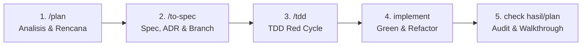

# SDLC Workflow Rules — Kurs World

Seluruh pengerjaan fitur, refactor, atau perbaikan bug di repository `kurs-world` **WAJIB** mengikuti alur 5 tahap berurutan berikut tanpa melewatkan langkah apapun:

---

## 1. Tahap 1 — `/plan` (Requirement Analysis & Implementation Plan)
* **Tujuan**: Memahami kebutuhan secara utuh dan merancang strategi eksekusi sebelum mengubah kode aplikasi.
* **Aktivitas**:
  1. Telusuri codebase, arsitektur, dan file relevan (gunakan `view_file`, `grep_search`, atau MCP graph).
  2. Susun `implementation_plan.md` di direktori artifact dengan format baku (Goal, Review Required, Open Questions, Proposed Changes, Verification Plan).
  3. Set `RequestFeedback: true` dan `UserFacing: true` pada `ArtifactMetadata`.
  4. Tunggu konfirmasi/approval user sebelum melakukan modifikasi kode aplikasi.

---

## 2. Tahap 2 — `/to-spec` (Spesifikasi Teknis, ADR & Branch Creation)
* **Tujuan**: Mengunci keputusan arsitektur, data invariants, dan kontrak API secara formal.
* **Aktivitas**:
  1. Tulis ADR di `docs/adr/000X-xxx.md` jika ada keputusan arsitektur/desain baru.
  2. Perbarui spesifikasi teknis di `docs/specs/` bila ada penambahan fitur atau perubahan kontrak API.
  3. Buat branch git baru dari `main` sesuai konvensi (`feat/...`, `fix/...`, `refactor/...`, `docs/...`).
  4. Pastikan working tree bersih sebelum membuat branch (`rtk git status`).

---

## 3. Tahap 3 — `/tdd` (Test-Driven Development — Red Cycle)
* **Tujuan**: Memastikan correctness dari awal dengan mendefinisikan test cases sebelum menulis implementasi.
* **Aktivitas**:
  1. Tulis unit test atau API test di `frontend/tests/` atau `src/tests/` (Vitest / Bun Test).
  2. Sertakan test coverage untuk skenario happy path, edge cases (micro-rates, pembagian nol, input negatif, string kosong), dan boundary invariants.
  3. Jalankan test (`rtk bun test`) dan pastikan test berada dalam kondisi gagal (*Red State*) atau mendefinisikan ekspektasi baru.
  4. Gunakan commit sementara bertanda `wip: test(...)` jika dibutuhkan.

---

## 4. Tahap 4 — `implement` (Green Cycle & Refactor)
* **Tujuan**: Menulis kode implementasi minimal hingga seluruh test lulus, dilanjutkan dengan refactor bersih.
* **Aktivitas**:
  1. Tulis kode produksi di Elysia routes/services/providers atau Svelte 5 components hingga seluruh test lulus (*Green State*).
  2. Refactor: Bersihkan boilerplate, hilangkan duplikasi kode, pastikan implementasi mengikuti standar UI/UX (shadcn-svelte, shimmer skeleton, CSS tokens).
  3. Pastikan tidak ada floating promises, memory leaks, atau unhandled exceptions.

---

## 5. Tahap 5 — `check hasil/plan` (Quality Gates, Audit & Walkthrough)
* **Tujuan**: Verifikasi menyeluruh dan pelaporan hasil kerja kepada user.
* **Aktivitas**:
  1. **Diagnostics Check**: `rtk bun run check` (Wajib 0 errors, 0 warnings pada `svelte-check`).
  2. **Automated Testing**: `rtk bun test` (Wajib 100% tests lulus).
  3. **Bundle Build**: `rtk bun run build` (Wajib berhasil build tanpa error).
  4. **Security & Secrets Check**: Pastikan tidak ada hardcoded credentials atau potensi celah SSRF.
  5. **Walkthrough Artifact**: Buat/perbarui `walkthrough.md` di direktori artifact yang merangkum hasil kerja, perbandingan sebelum vs sesudah, dan bukti test pass.
  6. **Git Commit**: Commit perubahan dengan Conventional Commits (`feat: ...`, `fix: ...`, `refactor: ...`).
