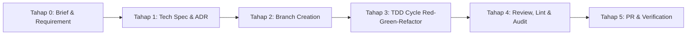

# AGENTS.md — Kurs World

Dokumen ini adalah panduan utama dan wajib bagi AI coding agent (Antigravity, Claude Code, Cursor, dll.) saat membaca, merancang, menulis, atau memodifikasi kode di project **kurs-world**. Seluruh instruksi, standar SDLC, dan batasan keamanan di dokumen ini wajib dipatuhi tanpa pengecualian.

---

## 1. Project Overview

**Nama Project:** Kurs World (`kurs-world`)  
**Deskripsi:** Platform agregator informasi kurs mata uang real-time yang mengumpulkan data nilai tukar dari berbagai bank sentral (Bank Indonesia, ECB, FRED), bank komersial nasional (BCA, Mandiri, BRI, BNI, CIMB Niaga), dan money changer terpercaya. Dilengkapi dengan tabel perbandingan kurs *side-by-side*, multi-source converter instan, grafik histori tren interaktif, sistem notifikasi *Rate Alert*, shareable rate card, serta Public Developer REST API berkinerja tinggi (<50ms edge cache response).

**Filosofi & Prinsip Utama:**
- **"Informasi Dulu, Transaksi Belakangan"**: Memberikan data transparan, jujur, tanpa registrasi wajib, tanpa iklan invasif, dan tanpa bias komersial.
- **Edge-First & Serverless**: Dibangun di atas runtime **Cloudflare Workers** & **Elysia.js** dengan frontend **Svelte 5** untuk latensi minimal di seluruh dunia dan ukuran bundle JavaScript ultra-ringan.
- **Transparansi Sumber**: Setiap data kurs wajib mencantumkan sumber (*Rate Provider*) dan timestamp pengambilan data yang jelas.
- **Konteks Indonesia**: Mengutamakan IDR sebagai mata uang dasar (*Base Currency*) dengan format penulisan angka baku Indonesia (`Rp 15.850,00`).
- **Zero CLS & High-Fidelity UX**: Setiap tampilan asinkron wajib memiliki shimmer skeleton yang presisi untuk menghindari layout shift dan flicker layar kosong.
- **SDLC & Branch Discipline**: Tidak ada commit langsung ke branch `main`. Seluruh pengembangan mengikuti GitHub Flow, TDD, dan Git Safety Constraints.

---

## 2. Tech Stack

| Layer | Teknologi | Keterangan |
|---|---|---|
| **Backend & API Framework** | **Elysia.js (TypeScript on Bun)** | Framework web performa tinggi dengan type safety penuh (TypeBox / Eden) |
| **Serverless Runtime & Host** | **Cloudflare Workers & Cloudflare Pages** | Edge execution global, zero cold-start, latensi sub-50ms |
| **Scheduled Ingestion Worker** | **Cloudflare Cron Triggers & Queues** | Cron feed 15 menit, worker scraping, anomaly validation |
| **Frontend Web Application** | **Svelte 5 (Runes), Vite / SvelteKit** | Web SPA / SSR modern, reaktivitas halus, bundle ultra-ringan |
| **Styling & UI Components** | **Tailwind CSS v4, shadcn-svelte (Bits UI), Lucide Svelte** | Wajib menggunakan komponen resmi shadcn-svelte, dilarang elemen HTML telanjang |
| **Frontend Runtime & Package Mgr**| **Bun (v1.4+) (Wajib)** | Semua instalasi, script runner, dan testing menggunakan `bun` |
| **Database & ORM** | **Cloudflare D1 / PostgreSQL (Hyperdrive) + Drizzle ORM** | Edge database relational untuk time-series kurs, user alert, dan API keys |
| **Edge Cache & Rate Limiter** | **Cloudflare KV / Upstash Redis** | Caching live rates (TTL 15m SWR), sliding window / token bucket rate limiter |
| **Email & Notification Alert** | **Cloudflare Email Service & Web Push** | Notifikasi rate alert transaksional |
| **Charts & Visualisasi** | **LayerChart / Recharts / Lightweight Charts** | Visualisasi tren pergerakan nilai tukar (7d, 30d, 90d, 365d) |
| **Testing Framework** | **Vitest / Bun Test** | Unit testing & API integration test TDD |
| **Deployment CLI** | **Wrangler v3+** | Cloudflare Workers & Pages deployment tooling |
| **Command Proxy** | **RTK (Rust Token Killer)** | Semua perintah shell/terminal di-proxy via `rtk` untuk efisiensi token |

---

## 3. Repository & Workspace Structure

```
kurs-world/
│
├── src/                            # Backend API & Workers (Elysia.js + Cloudflare Workers)
│   ├── index.ts                    # Entrypoint Elysia app (Fetch & Scheduled handler)
│   ├── domain/                     # Domain entities, interfaces & value objects (Rate, Provider, Alert, APIKey)
│   ├── service/                    # Business use cases (aggregator, converter, comparator, alert, developer)
│   ├── provider/                   # Rate Provider adapters (BI, BCA, Mandiri, BRI, BNI, CIMB, ECB, FRED)
│   │   ├── bi.ts
│   │   ├── bca.ts
│   │   ├── mandiri.ts
│   │   └── ecb.ts
│   ├── db/                         # Drizzle schema, migrations, D1/Hyperdrive client
│   │   ├── schema.ts
│   │   └── index.ts
│   ├── cache/                      # Cloudflare KV SWR caching helpers
│   ├── ratelimit/                  # Edge rate limiter per API key / IP
│   ├── alert/                      # Web Push & Cloudflare Email dispatcher
│   ├── routes/                     # Elysia routes (Rates, Convert, History, Alerts, Public API)
│   │   ├── rates.ts
│   │   ├── convert.ts
│   │   ├── history.ts
│   │   ├── alerts.ts
│   │   └── public-api.ts
│   └── middleware/                 # API key validator, rate-limit, error handler, CORS
│
├── frontend/                       # Svelte 5 + Vite / SvelteKit + shadcn-svelte (Bun v1.4+)
│   ├── src/
│   │   ├── routes/                 # App routes / pages
│   │   ├── lib/
│   │   │   ├── components/         # Reusable UI & shadcn-svelte components
│   │   │   │   ├── ui/             # Official shadcn-svelte (Bits UI) primitives
│   │   │   │   └── skeletons/      # High-fidelity shimmer skeletons
│   │   │   ├── features/           # Feature modules (matrix, converter, charts, alerts, apidocs)
│   │   │   ├── api/                # Eden Treaty / fetch API client
│   │   │   └── formatters/         # Rupiah and percentage formatters
│   │   └── app.css                 # Tailwind CSS v4 & design tokens
│   ├── tests/                      # Vitest unit & integration tests
│   ├── package.json
│   └── svelte.config.js
│
├── drizzle/                        # SQL migration files generated by Drizzle
├── drizzle.config.ts               # Drizzle ORM configuration
├── wrangler.jsonc                  # Cloudflare Workers configuration (Bindings: D1, KV, Cron)
├── package.json                    # Root package.json (Bun workspaces)
├── bunfig.toml                     # Bun configuration
├── docs/                           # Dokumentasi terstruktur
│   ├── adr/                        # Architecture Decision Records
│   ├── specs/                      # PRD, Tech Spec, Design Spec
│   ├── brief/                      # Project Brief & Executive Summary
│   ├── guides/                     # Development & Integration Guides
│   ├── reports/                    # Security & Benchmark Audits
│   ├── runbooks/                   # Deployment & Operational Runbooks
│   └── research/                   # Provider API research & benchmarks
│
├── .agents/                        # Agent workflows, rules & automation scripts
│   ├── rules/                      # Project-specific agent rules
│   └── scripts/                    # Automation helper scripts
│
├── AGENTS.md                       # Source of Truth panduan AI Agent (file ini)
├── CONTEXT.md                      # Ubiquitous Domain Language
├── ARCHITECTURE.md                 # System Architecture & Flow Design
├── CLAUDE.md                       # Quick reference untuk Claude Code
├── GEMINI.md                       # Quick reference untuk Gemini/Antigravity
└── README.md                       # Project landing doc
```

---

## 4. Git Safety Constraints & Branching Strategy

### 🔒 Batasan Keamanan Git (Dilarang Keras)
1. **DILARANG** melakukan `git push` langsung ke branch `main`.
2. **DILARANG** melakukan `git push --force` ke branch bersama tanpa izin eksplisit.
3. **DILARANG** memulai task baru di atas *dirty working tree* (uncommitted changes).
4. **DILARANG** melakukan `git reset --hard` atau `rebase -i` pada commit yang sudah di-push.
5. **DILARANG** merge PR jika automated tests / CI masih gagal (merah).

### 🌿 Format Branching (GitHub Flow)
Selalu buat branch baru dari `main` sebelum memulai task:
* `feat/<scope>-<deskripsi-singkat>` (contoh: `feat/aggregator-bca-adapter`)
* `fix/<scope>-<deskripsi-singkat>` (contoh: `fix/converter-zero-division`)
* `refactor/<scope>-<deskripsi-singkat>` (contoh: `refactor/kv-swr-cache`)
* `docs/<scope>-<deskripsi-singkat>` (contoh: `docs/specs-prd-v1`)
* `chore/<scope>-<deskripsi-singkat>` (contoh: `chore/bump-bun-deps`)

### 📝 Format Commit Message (Conventional Commits)
* Format: `type(scope): ringkasan perubahan dalam bentuk imperatif`
* Saat iterasi TDD, gunakan prefix `wip:` pada commit sementara:
  * `wip: test(converter): add failing test for negative amounts`
  * `feat(converter): implement validation for non-negative inputs`

---

## 5. SDLC Workflow (6 Tahap Baku)



1. **Tahap 0 — Analisis Kebutuhan**: Baca [docs/brief/BRIEF.md](file:///home/archy/Projects/kurs-world/docs/brief/BRIEF.md), [CONTEXT.md](file:///home/archy/Projects/kurs-world/CONTEXT.md), dan [docs/specs/PRD.md](file:///home/archy/Projects/kurs-world/docs/specs/PRD.md).
2. **Tahap 1 — Spesifikasi Teknis & ADR**: Tulis ADR di [docs/adr/](file:///home/archy/Projects/kurs-world/docs/adr/) untuk setiap keputusan arsitektur baru.
3. **Tahap 2 — Buat Branch**: Buat branch sesuai konvensi di atas.
4. **Tahap 3 — TDD (Test-Driven Development)**:
   * **Red**: Tulis unit test (Vitest/Bun test) yang mendefinisikan behavior yang diharapkan (test gagal dulu).
   * **Green**: Tulis kode implementasi Elysia / Svelte minimal hingga test lulus.
   * **Refactor**: Bersihkan kode, optimasi performa, pastikan readability terjaga.
5. **Tahap 4 — Quality & Security Audit**: Jalankan linter (`bun run lint`), type-check (`bun run check`), security audit (`bun run audit:fix`), dan pastikan tidak ada secret hardcoded.
6. **Tahap 5 — PR & Review**: Ajukan Pull Request dengan ringkasan lengkap, bukti test, dan breaking change notes.

---

## 6. Frontend UI/UX Standards (Svelte 5 & shadcn-svelte)

1. **shadcn-svelte (Bits UI) Component Mandate (Wajib)**:
   * **DILARANG** menggunakan elemen form/interaktif HTML native mentah (seperti `<select>`, modal `<div fixed>`, unstyled alert box).
   * **WAJIB** menggunakan komponen resmi **shadcn-svelte** / Bits UI:
     * `Select`, `Dialog`, `Sheet`, `Popover`, `DropdownMenu`
     * `Alert`, `AlertTitle`, `AlertDescription`
     * `Button`, `Input`, `Tabs`, `Badge`, `Card`, `Table`
2. **Svelte 5 Runes Paradigm**:
   * Gunakan runes modern Svelte 5 (`$state()`, `$derived()`, `$props()`, `$effect()`) untuk state management reaktif.
3. **High-Fidelity Shimmer Skeletons**:
   * Setiap komponen yang mengambil data secara asinkron (Tabel Kurs, Form Konverter, Grafik Histori, Modal Alert) **WAJIB** memiliki state loading berupa skeleton beranimasi (`animate-shimmer` / `Skeleton`).
   * Struktur skeleton harus merefleksikan layout data nyata untuk mencegah Cumulative Layout Shift (CLS < 0.1).
4. **Format Angka & Mata Uang**:
   * Gunakan locale `id-ID` untuk format rupiah: `Rp 15.850,00`.
   * Tampilkan persentase perubahan dengan warna semantik: Hijau (Menguat / Naik bagi IDR) dan Merah (Melemah / Turun bagi IDR), dilengkapi badge indikator `+0.25%` / `-0.15%`.

---

## 7. Cloudflare Workers & Ingestion Security Invariants

1. **SSRF & Ingestion Protection**:
   * Ingestion fetch client hanya boleh memanggil domain provider yang terdaftar di allowlist (`bi.go.id`, `bca.co.id`, `bankmandiri.co.id`, dll.).
   * Request timeout strict: maksimal **5 detik** per request provider via `AbortSignal.timeout(5000)`.
   * Response body limit: maksimal **5 MB** untuk mencegah memory spike pada Worker runtime.
2. **Data Integrity & Quarantine**:
   * Validasi nilai kurs: `buy_rate > 0`, `sell_rate > 0`, dan `sell_rate >= buy_rate`.
   * Jika nilai kurs anomali (misal `sell_rate < buy_rate` atau lonjakan >50% dalam 1 siklus), tahan data di tabel karantina (`quarantine_rates`) dan catat alert log.
3. **Public API Rate Limiting**:
   * Setiap request Public API divalidasi dengan middleware Cloudflare KV / Rate Limiter.
   * Header rate limit wajib disertakan: `X-RateLimit-Limit`, `X-RateLimit-Remaining`, `X-RateLimit-Reset`.
4. **Zero Hardcoded Secrets**:
   * Gunakan Wrangler secrets / environment bindings (`c.env.SECRET_NAME`), dilarang keras menaruh credentials langsung di kode.

---

## 8. Observability & Logging Standards

1. **Structured JSON Logging**:
   * Semua log wajib berformat JSON dengan atribut baku: `time`, `level`, `msg`, `requestId`, `provider`, `currency_pair`, `duration_ms`.
2. **Edge Analytics & Tracing**:
   * Pantau latency subrequest ke provider dan query database D1 via Cloudflare Worker Analytics Engine.

---

## 9. Tool Calling & Parameter Rules

1. **Absolute Paths Only**:
   * Semua pemanggilan tool file (`write_to_file`, `replace_file_content`, `view_file`, `list_dir`, `grep_search`, `find_by_name`) **WAJIB menggunakan full absolute path** (contoh: `/home/archy/Projects/kurs-world/...`).
   * **Dilarang keras** menggunakan tilde (`~`) atau relative path (`./...`, `docs/...`).
2. **Strict Schema Compliance**:
   * Saat memanggil `write_to_file`, parameter berikut wajib disertakan: `TargetFile`, `CodeContent`, `Overwrite`, `Description`, `toolAction`, `toolSummary`.

---

## 10. Documentation Invariants

Dokumentasi disimpan secara hierarkis di folder `docs/`:
* [docs/adr/](file:///home/archy/Projects/kurs-world/docs/adr/): Architecture Decision Records (`0001-xxx.md`).
* [docs/specs/](file:///home/archy/Projects/kurs-world/docs/specs/): Product & Technical Specifications (`PRD.md`, `TECH_SPEC.md`).
* [docs/brief/](file:///home/archy/Projects/kurs-world/docs/brief/): Project Brief & Ideation (`BRIEF.md`).
* [docs/guides/](file:///home/archy/Projects/kurs-world/docs/guides/): Panduan integrasi & setup developer.
* [docs/reports/](file:///home/archy/Projects/kurs-world/docs/reports/): Laporan audit keamanan, performa & benchmark.
* [docs/runbooks/](file:///home/archy/Projects/kurs-world/docs/runbooks/): Runbook operasional & deployment.
* [docs/research/](file:///home/archy/Projects/kurs-world/docs/research/): Riset data provider & benchmark API.

**Root Markdown Whitelist:** Hanya file berikut yang diizinkan berada di root workspace:
`README.md`, `ARCHITECTURE.md`, `CONTEXT.md`, `AGENTS.md`, `CLAUDE.md`, `GEMINI.md`.
Semua file `.md` lainnya **wajib** dimasukkan ke dalam subfolder `docs/` yang sesuai.
