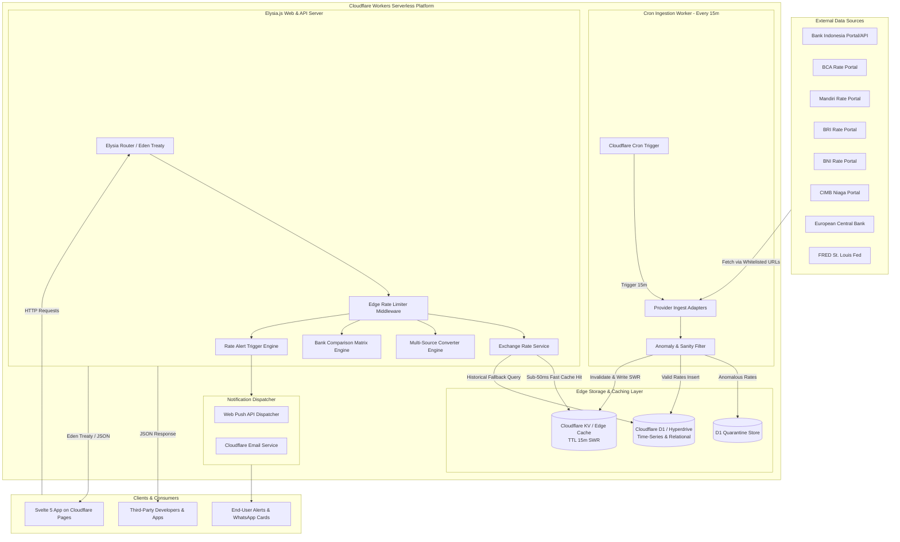
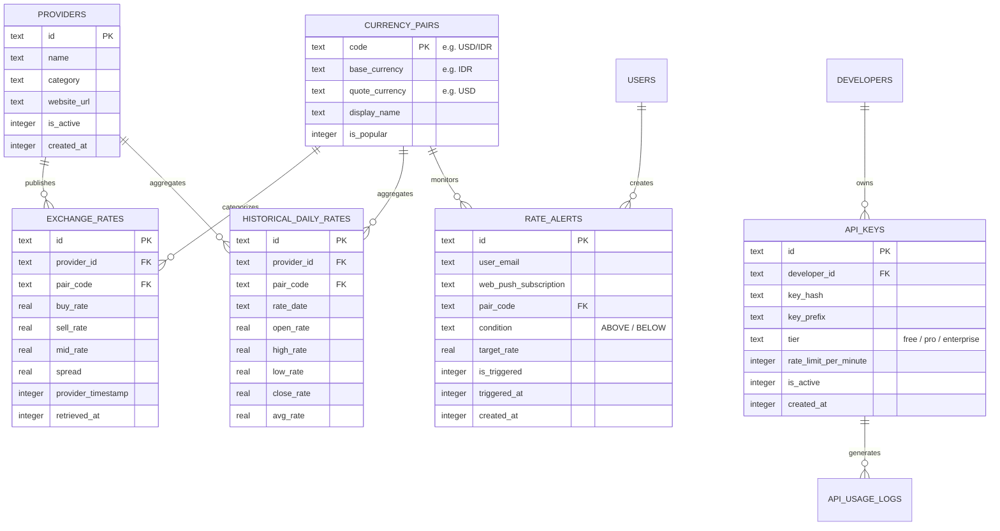

# ARCHITECTURE.md — Kurs World Architecture

Sistem arsitektur, diagram komponen, aliran data, dan standar desain teknis untuk platform **kurs-world** berbasis **Cloudflare Workers**, **Elysia.js**, dan **Svelte 5**.

---

## 1. High-Level Architecture Overview

Platform **kurs-world** dirancang dengan arsitektur serverless edge modern di atas infrastruktur **Cloudflare Workers**. Mengutamakan latensi global rendah (<50ms untuk response ter-cache di edge), skalabilitas otomatis (*zero cold-start*), bundle JavaScript minimal melalui **Svelte 5 (Runes)**, serta integritas data finansial yang tinggi.



---

## 2. Ingestion Pipeline & Anomaly Quarantine

Proses pengambilan kurs berjalan setiap 15 menit melalui Cloudflare Worker `scheduled` event:

1. **Provider Adapter Interface (TypeScript)**:
   ```typescript
   export interface RateProvider {
     id: string;
     name: string;
     fetchRates(): Promise<ExchangeRate[]>;
   }
   ```
2. **SSRF Protection & Timeout Guard**:
   * Outbound `fetch()` hanya diizinkan ke domain resmi yang terdaftar di allowlist (`bi.go.id`, `bca.co.id`, `bankmandiri.co.id`, dll.).
   * Menggunakan `AbortSignal.timeout(5000)` (hard limit 5 detik per request).
   * Batasan response body 5 MB untuk efisiensi memori Worker.
3. **Data Sanity & Anomaly Quarantine**:
   * Memastikan `buy_rate > 0`, `sell_rate > 0`, dan `sell_rate >= buy_rate`.
   * Jika nilai kurs melonjak >50% dari snapshot sebelumnya atau terjadi inversi spread, data dialihkan ke tabel `quarantine_rates` di D1 dan mencatat log warning.
4. **Cache Invalidation (SWR)**:
   * Hasil normalisasi disimpan ke Cloudflare D1.
   * Kunci Cloudflare KV di-refresh: `rates:latest:{pair}` dan `rates:matrix:{base}` dengan TTL 15 menit.

---

## 3. Database Schema (Drizzle ORM & Cloudflare D1)



---

## 4. Frontend Architecture (Svelte 5 & shadcn-svelte)

* **Svelte 5 Runes**: Memanfaatkan state management reaktif modern `$state` dan `$derived` untuk instant calculation pada konverter multi-sumber tanpa re-render berlebihan.
* **Component System**: Menggunakan **shadcn-svelte (Bits UI)** untuk komponen UI konsisten, aksesibel, dan elegan.
* **Eden Treaty Client**: Menghubungkan Svelte frontend dengan Elysia backend dengan type-safety penuh secara *compile-time*.
* **Zero CLS Skeletons**: Seluruh komponen asinkron dilengkapi komponen skeleton shimmer presisi.

---

## 5. Edge Caching & Stale-While-Revalidate (SWR)

* **Cloudflare KV**:
  * `rates:latest`: Cache seluruh pasangan mata uang aktif (TTL 15m).
  * `rates:compare:{pair}`: Cache tabel perbandingan per mata uang (TTL 15m).
  * `rates:history:{pair}:{range}`: Cache data histori time-series (TTL 1 jam).
* **Pattern**: Data dikembalikan langsung dari Edge KV (<50ms). Ingestion worker background memperbarui KV secara periodik.

---

## 6. Public Developer API & Edge Rate Limiting

* Framework: **Elysia.js** dengan OpenAPI Swagger otomatis di `/swagger`.
* Client SDK Type-Safety: didukung via **Eden Treaty** untuk integrasi langsung ke frontend TypeScript.
* Autentikasi: Header `X-API-Key: kw_live_...`.
* Rate Limiter: Cloudflare KV sliding-window counter atau Cloudflare Rate Limiting binding:
  * **Free**: 100 req/menit.
  * **Pro**: 1.000 req/menit.
  * **Enterprise**: Custom limit & webhooks.
