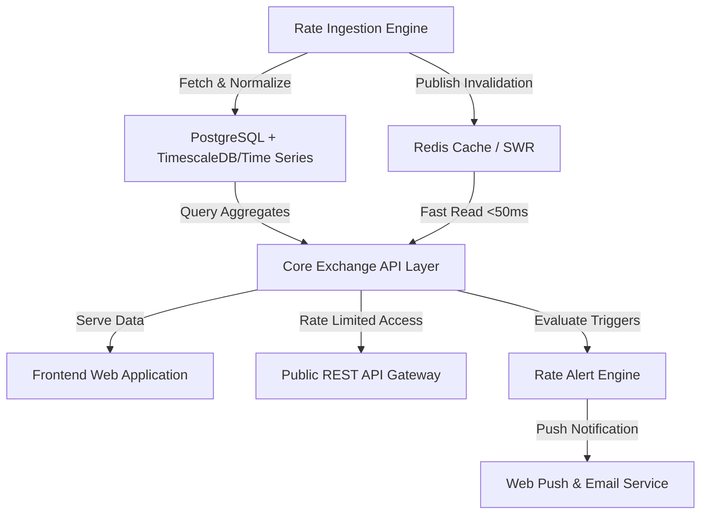

# Kurs World Domain Context

Domain model and ubiquitous language for **kurs-world** — real-time multi-source currency exchange rate aggregator, comparative analytics matrix, and public developer API.

---

## Ubiquitous Language

### Core Entities & Domain Terms

**Kurs World**:
The centralized platform aggregating foreign exchange rates from multiple Indonesian banks, central banks, and global market references into an intuitive comparison dashboard, multi-source converter, and public REST API.  
_Avoid_: Forex broker, trading platform, currency exchange desk, money changer app

**Base Currency**:
The anchor currency against which exchange rates and conversions are evaluated, with Indonesian Rupiah (`IDR`) as the primary default base currency.  
_Avoid_: Home valas, primary asset

**Quote / Target Currency**:
The foreign currency paired against the Base Currency (e.g., `USD`, `EUR`, `SGD`, `JPY`, `GBP`, `AUD`, `CNY`, `SAR`).  
_Avoid_: Secondary money, traded pair

**Currency Pair**:
A normalized financial pair identifier formatted as `BASE/QUOTE` (e.g., `USD/IDR`, `EUR/IDR`, `SGD/IDR`).  
_Avoid_: Ticker symbol, stock code

**Rate Provider**:
An external verified source publishing foreign exchange rates, categorized into:
- **Central Banks**: Bank Indonesia (`BI`), European Central Bank (`ECB`), Federal Reserve Economic Data (`FRED`).
- **Commercial Banks**: Bank Central Asia (`BCA`), Bank Mandiri (`MANDIRI`), Bank Rakyat Indonesia (`BRI`), Bank Negara Indonesia (`BNI`), CIMB Niaga (`CIMB`).
- **Money Changers / Market Reference**: Authorized foreign exchange dealers and interbank benchmarks.  
_Avoid_: Bank vendor, scraping target, rate API

**Exchange Rate Types**:
- **Buy Rate (Kurs Beli)**: The price at which the provider buys foreign currency from the customer (customer sells foreign currency to receive IDR).
- **Sell Rate (Kurs Jual)**: The price at which the provider sells foreign currency to the customer (customer buys foreign currency using IDR).
- **Mid Rate (Kurs Tengah)**: The arithmetic average `(Buy Rate + Sell Rate) / 2` or official central bank reference rate.
- **Spread**: The difference between Sell Rate and Buy Rate (`Sell - Buy`), representing provider transaction cost and margin.  
_Avoid_: Price buy/sell, dollar rate, margin tax

**Rate Snapshot / Feed Record**:
A timestamped record capturing the state of exchange rates for a specific currency pair from a designated Rate Provider at a precise moment, including `buy_rate`, `sell_rate`, `mid_rate`, `spread`, `retrieved_at`, and `provider_timestamp`.  
_Avoid_: Price row, rate tick

---

### Functional Components & Features

**Multi-Source Rate Aggregator**:
The automated ingestion pipeline that schedules, fetches, normalizes, validates, and stores exchange rates from registered Rate Providers with jitter-resistant retry loops and rate-limit backoffs.  
_Avoid_: Scraper cron, rate puller

**Rate Comparison Matrix**:
A real-time comparative view displaying side-by-side exchange rates across all participating Rate Providers for a selected currency pair, automatically highlighting the best provider for buying (lowest Sell Rate) and selling (highest Buy Rate).  
_Avoid_: Price list, bank table

**Multi-Source Currency Converter**:
An interactive conversion calculator that computes converted amounts across all available Rate Providers simultaneously from a single input amount, enabling users to evaluate the real monetary difference between banks.  
_Avoid_: Standard calculator, forex math

**Historical Rate Series & OHLC**:
Aggregated daily and intraday time-series data for trend visualization (7d, 30d, 90d, 365d, all-time), tracking Open, High, Low, Close (OHLC), moving averages, and percentage change.  
_Avoid_: Price chart history, stock trend

**Rate Alert Engine**:
The event-driven notification subsystem that evaluates user-defined threshold triggers (e.g., *"Notify me when USD/IDR drops below 15,500"*) and dispatches notifications via Browser Push (Web Push API) and Transactional Email.  
_Avoid_: Bot spammer, email blaster

**Shareable Rate Card**:
A dynamically generated snapshot card (OpenGraph image, PNG, or SVG) formatted for quick sharing via WhatsApp, Telegram, or social media with branding and timestamped rate data.  
_Avoid_: Screenshot tool, rate poster

**Public REST API**:
The public-facing programmatic HTTP interface exposing endpoints for current rates, historical time-series, conversion calculations, and bank comparisons with OpenAPI 3.1 / Swagger documentation.  
_Avoid_: Internal backend, raw endpoint

**Developer API Key & Tier Quota**:
Cryptographic API token issued to developers with rate-limiting constraints managed via Token Bucket algorithms:
- `tier_free`: 100 requests / minute, daily rate feeds.
- `tier_pro`: 1,000 requests / minute, 15-minute live feeds, historical API access.
- `tier_enterprise`: Dedicated rate limits, custom webhooks, SLA guarantee.  
_Avoid_: Secret pass, user token

**Cache & Freshness Guard (SWR)**:
In-memory caching layer (Redis / In-Memory KV) implementing Stale-While-Revalidate (SWR) caching with a 15-minute standard TTL to shield provider endpoints and deliver sub-50ms API responses.  
_Avoid_: Hard cache, DB bypass

---

## Domain Architecture Boundaries

---

## Domain Invariants & Rules

1. **Non-Negative Rates**: All exchange rates (`buy_rate`, `sell_rate`, `mid_rate`) must be strictly positive floating-point numbers (`> 0.0`).
2. **Spread Consistency**: `sell_rate` must always be greater than or equal to `buy_rate` (`sell_rate >= buy_rate`). If a provider returns inverted rates, the ingestion pipeline must flag an anomaly and quarantine the record.
3. **Provider Attribution**: Every rate displayed in UI or API responses must explicitly state the source `RateProvider` and the `retrieved_at` timestamp.
4. **Idempotent Ingestion**: Re-running an ingestion cycle for the same provider and timestamp must not produce duplicate records in the time-series store.
5. **No Financial Advisory**: kurs-world provides purely informational aggregated data. Disclaimer regarding non-transactional nature must accompany all calculations and rate views.
