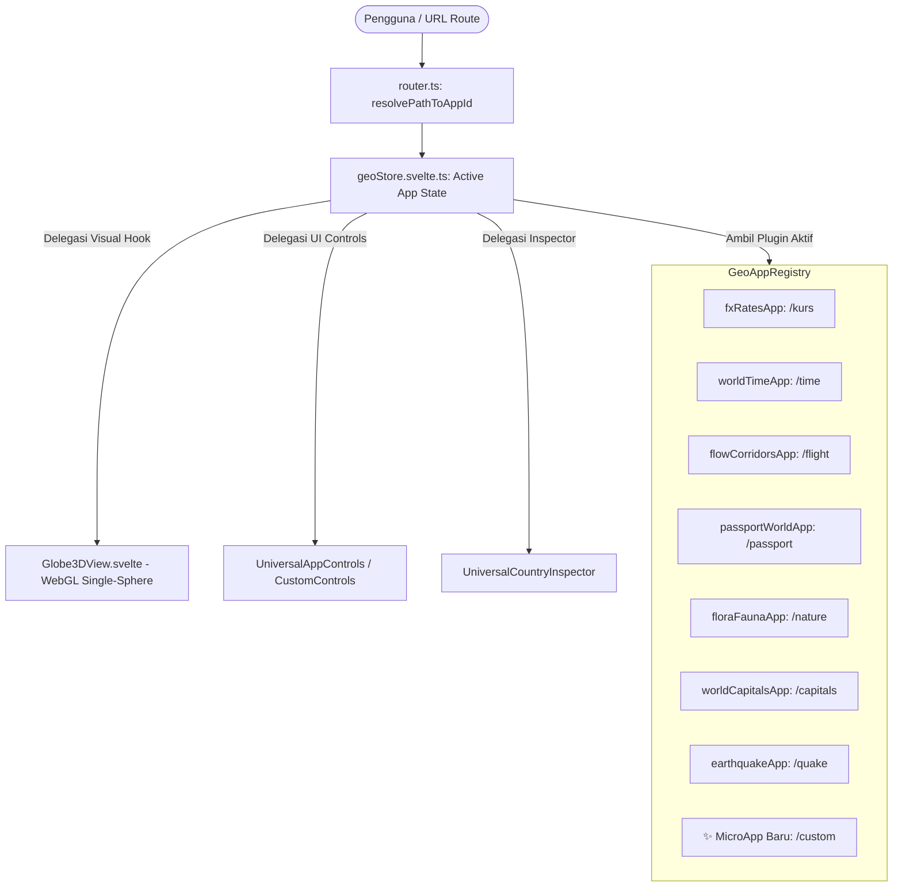

# Buanasphere Domain Context & AI Micro-App Guide

Dokumen ini adalah **Ubiquitous Domain Language** dan **Panduan Arsitektur Resmi** bagi AI coding agent (Antigravity, Claude Code, Cursor, Copilot, dll.) ketika membaca, merancang, mengimplementasikan, atau memperluas platform **Buanasphere** (`kurs-world`), khususnya saat membuat **Micro-App Plugin** baru pada sistem 3D GeoGlobe.

---

## 1. Platform Vision & Ubiquitous Language

**Buanasphere** adalah platform observatorium geospatial 3D planet bumi real-time yang mengintegrasikan berbagai lapisan data global (finansial, waktu, demografi, keanekaragaman hayati, sejarah geopolitik, dan kebencanaan) ke dalam kanvas bola dunia interaktif berbasis WebGL (Three.js & Globe.gl), didukung runtime Cloudflare Workers & Svelte 5 (Runes).

### Filosofi Utama
- **"Informasi Dulu, Transaksi Belakangan"**: Menyajikan data faktual, transparan, netral, tanpa paywall, tanpa registrasi paksa, dan tanpa bias komersial.
- **Konteks Indonesia Berwawasan Global**: Mengutamakan perspektif Indonesia (WIB, IDR, paspor WNI, diaspora) sebagai baseline, sambil memetakan 195+ negara berdaulat di seluruh dunia.
- **Edge-First & Sub-50ms Response**: Seluruh komputasi data dan caching berjalan di jaringan Cloudflare Edge (Workers, D1, KV) dengan bundle frontend ultra-ringan.
- **Pluggable & Autonomous**: Penambahan observatorium data baru tidak boleh memodifikasi core engine secara monolitik (Zero Hardcoded Switch Statements).

---

### Daftar Istilah Domain (Ubiquitous Vocabulary)

| Istilah | Definisi Baku | Hindari Penggunaan Istilah |
|---|---|---|
| **Buanasphere** | Nama resmi ekosistem platform observatorium geospatial planet bumi (*Buana* = Jagad/Bumi/Semesta + *Sphere* = Bola Dunia 3D). | Kurs World (sebagai nama platform keseluruhan), 3D map app, GIS portal |
| **Micro-App (GeoAppPlugin)** | Modul observatorium data independen yang dapat dipasang (*plug-and-play*) ke dalam kanvas bola dunia 3D. | Halaman biasa, route page, submodule, child page |
| **Spatial Country Metadata** | Metadata geografis standar 195+ negara (`iso3`, `countryName`, `lat`, `lng`, `capital`, `region`, `continent`, `flagEmoji`). | Country object, map record, DB row |
| **Rate Provider** | Sumber resmi penyedia nilai tukar (Bank Indonesia, BCA, Mandiri, BRI, BNI, ECB, FRED). | Vendor bank, scraper target |
| **Diurnal Solar Cycle** | Siklus 8 fase pencahayaan matahari bumi (Sunrise, Morning, Solar Noon, Afternoon, Sunset, Dusk, Night, Midnight). | Day/night toggle, dark mode map |
| **GeoArc** | Kurva lintasan 3D melengkung di atmosfer bumi untuk visualisasi rute terbang atau koridor remitansi. | 3D line, arrow, bezier spline |
| **GeoRing** | Gelombang cincin melingkar yang berdenyut dari titik koordinat (misal: episentrum gempa bumi). | Wave circle, radar pulse |
| **GeoPath** | Garis poligon koordinat geografis di permukaan bumi (misal: garis meridian 24 zona waktu UTC). | Vector line, polyline |
| **Inspector Drawer** | Panel detail sisi kanan yang menampilkan profil mendalam negara/kota terpilih saat diklik di bola dunia. | Popup modal, detail sheet, sidebar info |
| **Universal App Controls** | Komponen kontrol mengambang di sudut kanan atas untuk mencari negara/kota, memilih metrik, dan mengatur proyeksi. | Map toolbar, settings panel |
| **Runes Paradigm** | Sistem reaktivitas modern Svelte 5 (`$state`, `$derived`, `$props`, `$effect`). | Svelte 4 store (`$writable`), `let:export` |
| **Shimmer Skeleton** | Animasi loading placeholders dengan geometri presisi untuk menjamin *Zero Cumulative Layout Shift* (CLS < 0.1). | Spinner, blank loading screen |

---

## 2. Arsitektur Pluggable GeoGlobe (ADR 0040 & ADR 0047)

Setiap observatorium pada Buanasphere diimplementasikan sebagai **`GeoAppPlugin<TData>`**. Seluruh rendering WebGL didelegasikan secara polimorfik melalui *duck-typing hooks*.



### Struktur Folder Micro-App
```
frontend/
├── public/data/<nama_app>_dataset.json            # Mirror static JSON untuk fetch
└── src/lib/
    ├── framework/geoglobe/
    │   ├── types.ts                               # Definisi kontrak GeoAppPlugin<TData>
    │   ├── appRegistry.ts                         # Registry instance (geoRegistry)
    │   ├── geoStore.svelte.ts                     # Svelte 5 reactive store pusat
    │   ├── router.ts                              # Path mapping & canonical routes
    │   ├── data/
    │   │   ├── <nama_app>_dataset.json            # Bundle dataset mentah
    │   │   └── <nama_app>Data.ts                  # Typed helper & query functions
    │   ├── plugins/
    │   │   └── <nama_app>App.ts                   # Implementasi GeoAppPlugin
    │   └── ui/
    │       ├── GeoAppLauncherModal.svelte         # Dialog pilih aplikasi (Grid 2 Kolom)
    │       └── UniversalCountryInspector.svelte   # Drawer inspector
    ├── apps/<nama_app>/                           # (Opsional) Komponen UI khusus
    │   ├── <Nama>Controls.svelte                  # Kontrol kustom (jika butuh search khusus)
    │   └── <Nama>BottomDock.svelte                # Dock bawah kustom
    └── i18n/locales/                              # Kamus multibahasa (id.ts & en.ts)
```

---

## 3. Panduan AI Agent: Langkah demi Langkah Membuat Micro-App Baru

Ketika user meminta membuat aplikasi mikro baru (misal: *Kabel Internet Bawah Laut*, *Satelit Orbit Real-Time*, *Indeks Kualitas Udara*, *Peringkat Militer*, dll.), AI Agent **WAJIB** mengikuti 8 langkah baku berikut:

---

### Langkah 1 — Siapkan Dataset Terstruktur (JSON + TypeScript Wrapper)

1. **Dataset Mentah JSON (`data/<app>_dataset.json`)**:
   - Wajib mencakup referensi kode ISO-3 negara (`IDN`, `USA`, `JPN`, `GBR`, dll.) yang cocok dengan `countrySpatialData.ts`.
   - Simpan di dua lokasi:
     - `frontend/src/lib/framework/geoglobe/data/<app>_dataset.json`
     - `frontend/public/data/<app>_dataset.json`
2. **TypeScript Data Wrapper (`data/<app>Data.ts`)**:
   - Definisikan tipe entitas data: `export interface MyAppData { ... }`
   - Buat fungsi query toleran: `export function getMyAppDataForCountry(iso3: string): MyAppData`
   - Berikan nilai default fallback jika negara tertentu belum memiliki data spesifik.

---

### Langkah 2 — Definisikan Plugin `GeoAppPlugin<TData>`

Buat file di `frontend/src/lib/framework/geoglobe/plugins/<app>App.ts`:

```typescript
import type { CountrySpatialMetadata, GeoAppPlugin, InspectorWidget } from '../types';
import { type MyAppData, getMyAppDataForCountry, ALL_MY_APP_DATA } from '../data/myAppData';

export const myNewApp: GeoAppPlugin<MyAppData> = {
  // Identitas & Navigasi
  id: 'my-new-app',                     // ID unik (kebab-case)
  name: 'My Planetary App',              // Nama tampilan
  tagline: 'Deskripsi singkat 1 kalimat fokus',
  icon: 'Activity',                     // Nama icon dari Lucide Svelte
  category: 'science',                  // 'finance' | 'time' | 'nature' | 'history' | 'disaster' | 'science'
  defaultMetricId: 'primary_metric',
  canonicalPath: '/my-app',             // URL path utama
  aliasPaths: ['/alias-1', '/alias-2'], // URL alias opsional

  // Branding Visual & Header
  branding: {
    main: 'My',
    sub: '.Sphere',
    accentColor: '#06b6d4',             // Warna aksen HEX
    disclaimer: 'Data diperbarui secara berkala dari sumber terverifikasi.',
  },

  // Splash Screen saat pertama kali dimuat
  splash: {
    stepText: 'Memuat data observatorium planet...',
    gradientFrom: 'from-cyan-500',
    gradientTo: 'to-blue-600',
  },

  // Filter Presets (ADR 0040)
  filterOptions: [
    { id: 'all', label: 'Semua Data' },
    { id: 'tier_1', label: 'Tingkat Unggulan ⭐' },
  ],
  filterPredicate: (iso3, filterValue, data, country) => {
    if (filterValue === 'all') return true;
    if (filterValue === 'tier_1') return data?.tier === 1;
    return true;
  },

  // Daftar Metrik Visual (bisa dipilih user di kontrol)
  metrics: [
    {
      id: 'primary_metric',
      label: 'Indeks Utama',
      unit: 'pts',
      formatValue: (val) => `${Number(val || 0).toLocaleString('id-ID')} Poin`,
      colorScale: (normalizedVal, rawVal) => {
        // Skala warna poligon WebGL (0.0 s.d 1.0 atau nilai mentah)
        if (normalizedVal > 0.8) return '#10b981'; // Emerald
        if (normalizedVal > 0.5) return '#06b6d4'; // Cyan
        if (normalizedVal > 0.2) return '#f59e0b'; // Amber
        return '#64748b';                          // Slate
      },
    }
  ],

  // Data Loader Asinkron
  dataLoader: async (countries: CountrySpatialMetadata[]) => {
    const map: Record<string, MyAppData> = {};
    for (const c of countries) {
      map[c.iso3] = getMyAppDataForCountry(c.iso3);
    }
    return map;
  },

  // --- Visual Delegation Hooks (Dipanggil otomatis oleh Globe3DView) ---

  // Warna Poligon Negara
  getPolygonColor: (country, data, activeMetric, theme) => {
    if (!data) return theme === 'dark' ? 'rgba(30, 41, 59, 0.7)' : 'rgba(226, 232, 240, 0.7)';
    return 'rgba(6, 182, 212, 0.85)';
  },

  // Tooltip saat Hover di Globe
  getTooltipHtml: (country, data, activeMetric, theme) => {
    return `
      <div class="p-2.5 bg-slate-900/95 border border-slate-700 rounded-xl shadow-2xl text-xs">
        <div class="flex items-center gap-2 font-bold text-white">
          <span>${country.flagEmoji}</span>
          <span>${country.countryName}</span>
        </div>
        <div class="mt-1 text-cyan-400 font-mono font-semibold">
          ${data ? data.formattedValue : 'Tidak ada data'}
        </div>
      </div>
    `;
  },

  // Pin Label 3D di Atas Negara/Kota
  getPinLabel: (country, data, activeMetric) => {
    return {
      text: `${country.flagEmoji} ${country.countryName}`,
      color: '#38bdf8',
      size: 0.9,
    };
  },

  // Format Data untuk Inspector Drawer Sisi Kanan
  renderInspector: (country, data, allData): InspectorWidget => {
    return {
      title: `${country.flagEmoji} ${country.countryName}`,
      type: 'stats',
      primaryValue: data?.formattedValue || 'N/A',
      subtitle: country.region,
      badge: {
        text: data?.statusLabel || 'Aktif',
        variant: 'success',
      },
      statsGrid: [
        { label: 'Kawasan', value: country.continent },
        { label: 'Ibukota', value: country.capital },
        { label: 'Koordinat', value: `${country.lat.toFixed(2)}°, ${country.lng.toFixed(2)}°` },
      ],
    };
  },
};
```

---

### Langkah 3 — Hook 3D Opsional (Arcs, Rings, Paths, Custom Labels)

Tergantung jenis data observatorium, gunakan hook berikut:
- **`getArcs(data, activeFilter)`**: Menggambar busur 3D melengkung di atmosfer (contoh: rute kabel bawah laut, penerbangan, atau remitansi TKI).
- **`getRingData(country, allData)`**: Menghasilkan denyut gelombang melingkar 3D (contoh: gempa bumi, stasiun relay).
- **`getPaths(data, activeMetric, theme)`**: Menggambar jalur garis di permukaan bumi (contoh: garis batas lempeng tektonik, meridian waktu).
- **`getCustomLabels(data, activeMetric, theme)`**: Menempatkan titik pin kota berpresisi tinggi (contoh: titik kota dunia dengan jam lokal real-time).

---

### Langkah 4 — Registrasi Plugin ke Core Engine

Daftarkan plugin baru Anda pada 3 titik wajib berikut:

1. **`frontend/src/lib/framework/geoglobe/geoStore.svelte.ts`**:
   ```typescript
   import { myNewApp } from './plugins/myNewApp';
   
   // Daftarkan di baris registrasi otomatis
   geoRegistry.register(myNewApp);
   ```

2. **`frontend/src/lib/framework/geoglobe/router.ts`**:
   ```typescript
   export const APP_PATH_MAP: Record<string, string> = {
     // ...
     '/my-app': 'my-new-app',
   };
   
   export const CANONICAL_APP_PATHS: Record<string, string> = {
     // ...
     'my-new-app': '/my-app',
   };
   ```

3. **`frontend/src/lib/components/GlobeLandingPage.svelte`**:
   Tambahkan kartu aplikasi pada array `APPS`:
   ```typescript
   {
     path: '/my-app',
     emoji: '🔬',
     name: 'My Planetary App',
     tagline: 'Observatorium Data Khusus',
     description: 'Deskripsi informatif dalam bahasa Indonesia...',
     gradFrom: '#06b6d4',
     gradTo: '#2563eb',
     borderColor: 'rgba(6,182,212,0.25)',
     badgeText: 'Sains · 195+ Negara',
     badgeColor: 'rgba(6,182,212,0.15)',
     badgeTextColor: '#67e8f9',
     glowColor: 'rgba(6,182,212,0.06)',
   }
   ```

4. **`frontend/src/lib/framework/geoglobe/ui/GeoAppLauncherModal.svelte`**:
   Tambahkan icon dari `lucide-svelte` ke kamus `ICONS` jika menggunakan icon khusus.

---

### Langkah 5 — Dukungan Multibahasa (i18n)

Perbarui file terjemahan di `frontend/src/lib/i18n/locales/`:
- `id.ts`: Tambahkan judul, deskripsi metrik, dan filter dalam Bahasa Indonesia.
- `en.ts`: Tambahkan padanan Bahasa Inggris.

---

### Langkah 6 — TDD Verification Suite (Wajib Lulus)

Buat unit test suite di `frontend/tests/<nama-app>.test.ts` menggunakan runtime Bun:

```typescript
import { describe, it, expect } from 'bun:test';
import { myNewApp } from '../src/lib/framework/geoglobe/plugins/myNewApp';
import { resolvePathToAppId } from '../src/lib/framework/geoglobe/router';

describe('My New Planetary Micro-App Plugin (TDD)', () => {
  it('implements standard GeoAppPlugin interface', () => {
    expect(myNewApp.id).toBe('my-new-app');
    expect(myNewApp.name).toBeDefined();
    expect(myNewApp.canonicalPath).toBe('/my-app');
    expect(myNewApp.metrics.length).toBeGreaterThanOrEqual(1);
  });

  it('resolves canonical and alias routes accurately in router', () => {
    expect(resolvePathToAppId('/my-app')).toBe('my-new-app');
  });

  it('provides rich inspector widget with valid metadata', () => {
    const mockCountry = { iso3: 'IDN', countryName: 'Indonesia', flagEmoji: '🇮🇩' } as any;
    const widget = myNewApp.renderInspector?.(mockCountry, {} as any);
    expect(widget).toBeDefined();
    expect(widget?.title).toContain('Indonesia');
  });
});
```

---

## 4. Standar UI/UX & Batasan Kualitas (Quality Gates)

AI Agent **DILARANG KERAS** melanggar standar berikut:

1. **Mandat Komponen shadcn-svelte (Bits UI)**:
   - **DILARANG** menggunakan tag native HTML telanjang: `<select>`, modal `<div fixed>`, alert box unstyled.
   - **WAJIB** menggunakan komponen resmi: `Select`, `Dialog`, `Sheet`, `Popover`, `Button`, `Input`, `Badge`, `Card`.
2. **High-Fidelity Shimmer Skeletons**:
   - Seluruh pemuatan data asinkron wajib memiliki animasi skeleton (`animate-shimmer`) yang merefleksikan geometri layout nyata.
3. **Format Mata Uang & Angka Indonesia**:
   - Gunakan format locale `id-ID` (`Rp 15.850,00`, pemisah ribuan titik `.`, pemisah desimal koma `,`).
4. **Performa WebGL 60 FPS**:
   - Hindari alokasi memori besar (`new Object()`, `map()`) di dalam render loop Three.js.
   - Gunakan Level-of-Detail (LOD) atau filter wilayah untuk menjaga fluiditas di perangkat mobile.
5. **Verifikasi Otomatis**:
   - Jalankan `rtk bun test` (semua test suite wajib 100% lulus).
   - Jalankan `rtk bun run check` (TypeScript & Svelte diagnostics wajib 0 error).

---

## 5. Ringkasan Micro-Apps yang Sudah Terpasang

| Micro-App ID | Path | Domain & Fitur Utama | Metrik Utama |
|---|---|---|---|
| `fx-rates` | `/kurs` | Nilai tukar 195+ valas vs IDR, bank komersial & sentral | `rate` (Kurs Tengah) |
| `world-time` | `/time` | Jam global real-time, spektrum diurnal surya 8-fase | `local_hour` (Jam Lokal) |
| `remittance-flow` | `/flight` | Rute remitansi diaspora 3D & koridor kiriman uang | `volume` (Volume USD) |
| `passport-power` | `/passport` | Kekuatan paspor WNI, matriks bebas visa & VoA | `visa_free` (Skor Akses) |
| `flora-fauna` | `/nature` | Keanekaragaman hayati, sebaran satwa & tumbuhan endemik | `biodiversity` (Skor Bioma) |
| `world-capitals` | `/capitals` | 195+ ibukota berdaulat, hari kemerdekaan, & lagu kebangsaan | `independence_year` |
| `earthquake-tracker` | `/quake` | Pemantauan aktivitas seismik global (M4.5+) & gelombang cincin 3D | `seismic_risk` (Risiko Seismik) |
| `nimda-operator` | `/nimda` | Konsol operasional edge, cache purge, karantina data | `telemetry` (Kesehatan Edge) |
