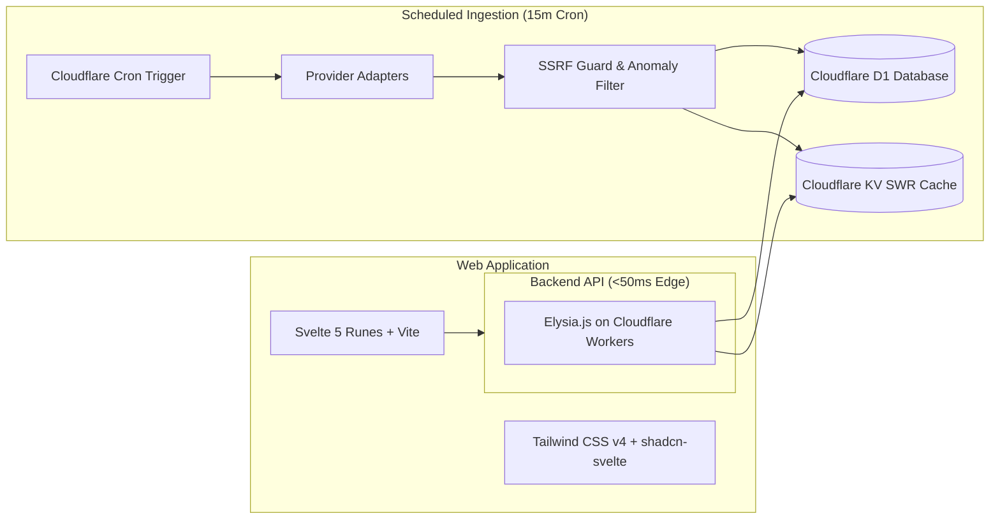

# 🌐 Buanasphere (`buanasphere`)

[](https://github.com/rafliiar17/buanasphere/actions)
[](https://www.typescriptlang.org/)
[](https://bun.sh)
[](https://workers.cloudflare.com/)
[](https://elysiajs.com)
[-FF3E00.svg)](https://svelte.dev)
[](LICENSE)
[](CONTRIBUTING.md)
[](CODE_OF_CONDUCT.md)

> **Platform Geospatial 3D Multi-Aplikasi Planet Bumi & Real-Time Intelligence**  
> *"Eksplorasi Data Dunia Real-Time Tanpa Hambatan"* — Menyediakan observasi bumi 3D interaktif mencakup nilai tukar valas, waktu diurnal, koridor remitansi diaspora, mobilitas paspor, biodiversitas alam, dan aktivitas seismik global (<50ms Edge Latency di [globe.arafz.id](https://globe.arafz.id)).

---

## 📌 Daftar Isi

- [Tentang Kurs World](#-tentang-kurs-world)
- [Fitur Utama](#-fitur-utama)
- [Sumber Data & Kepatuhan Atribusi](#-sumber-data--kepatuhan-atribusi)
- [Arsitektur & Tech Stack](#-arsitektur--tech-stack)
- [Struktur Monorepo](#-struktur-monorepo)
- [Panduan Memulai (Getting Started)](#-panduan-memulai-getting-started)
- [Pengujian & Standar Kualitas](#-pengujian--standar-kualitas)
- [Keamanan & Ingestion Guard](#-keamanan--ingestion-guard)
- [Penafian Hukum (Disclaimer)](#-penafian-hukum-disclaimer)
- [Lisensi](#-lisensi)

---

## 📖 Tentang Kurs World

**Kurs World** adalah platform agregator informasi nilai tukar mata uang asing (*foreign exchange*) berbasis edge serverless yang dirancang khusus untuk mempermudah masyarakat Indonesia, pelaku bisnis, traveler, serta developer dalam memantau, membandingkan, dan mengonversi kurs secara transparan dan akurat.

### 💡 Filosofi Inti
1. **Informasi Dulu, Transaksi Belakangan**: Menyediakan perbandingan jujur tanpa bias komersial, tanpa paywall tersembunyi, dan tanpa registrasi wajib.
2. **Konteks Indonesia**: Mengutamakan Indonesian Rupiah (`IDR`) sebagai mata uang dasar (*Base Currency*) dengan format penulisan angka baku Indonesia (`Rp 15.850,00`).
3. **Edge-First & Sub-50ms Response**: Berjalan di atas infrastruktur global Cloudflare Workers dengan caching Stale-While-Revalidate (SWR) pada Cloudflare KV.
4. **Zero Layout Shift (Zero CLS)**: Antarmuka dibangun dengan Svelte 5 (Runes) dan skeleton shimmer presisi untuk mencegah kedipan layar.

---

## 🚀 Fitur Utama

- 📊 **Tabel Perbandingan Kurs Multi-Bank (*Side-by-Side Matrix*)**:
  Membandingkan kurs beli (*Buy Rate*), kurs jual (*Sell Rate*), dan *spread* antar bank komersial, bank sentral, serta money changer secara langsung dengan indikator *Best Buy* dan *Best Sell*.
- 🔄 **Multi-Source Currency Converter**:
  Kalkulator konversi instan yang menghitung selisih hasil tukar riil dari seluruh penyedia kurs secara simultan dalam satu klik.
- 📈 **Grafik Tren Histori Interaktif**:
  Visualisasi riwayat pergerakan kurs interaktif bergaya Google Finance dengan rentang waktu 7 Hari, 30 Hari, 90 Hari, hingga 1 Tahun (365 Hari).
- 🌍 **Peta Dunia Kurs Interaktif (3D Globe & 2D Flat Map)**:
  Eksplorasi visual nilai tukar 195+ negara di dunia dengan tekstur bendera prosedural, pencarian negara cerdas, dan drawer inspektur mata uang.
- 🔔 **Sistem Notifikasi Nilai Tukar (*Rate Alert*)**:
  Peringatan otomatis saat nilai tukar mencapai target yang ditentukan melalui Web Push API dan Cloudflare Transactional Email.
- ⚡ **Public Developer REST API**:
  API publik berkinerja tinggi dengan dokumentasi interaktif OpenAPI / Swagger UI di `/swagger`.

---

## 🏛 Sumber Data & Kepatuhan Atribusi

Kurs World mengumpulkan data secara berkala dari sumber-sumber resmi dan tepercaya:

| Kategori Penyedia | Sumber / Provider | Deskripsi Data | URL Resmi |
|---|---|---|---|
| **Pasar Global / Benchmark** | **ExchangeRate-API** | Kurs acuan spot valas global untuk 160+ mata uang dunia | [ExchangeRate-API](https://www.exchangerate-api.com) |
| **Bank Sentral** | **Bank Indonesia (JISDOR)** | Jakarta Interbank Spot Dollar Rate & Kurs Transaksi BI | [bi.go.id](https://www.bi.go.id) |
| **Bank Komersial** | **Bank Central Asia (BCA)** | Kurs e-Rate & Banknotes BCA | [bca.co.id](https://www.bca.co.id) |
| **Bank Komersial** | **Bank Mandiri** | Kurs Transaksi & Special Rate Mandiri | [bankmandiri.co.id](https://www.bankmandiri.co.id) |
| **Bank Komersial** | **Bank Rakyat Indonesia (BRI)** | Kurs e-Rate & Counter Rate BRI | [bri.co.id](https://bri.co.id) |
| **Bank Komersial** | **Bank Negara Indonesia (BNI)** | Kurs Special Rate & Banknotes BNI | [bni.co.id](https://www.bni.co.id) |
| **Bank Komersial** | **CIMB Niaga** | OCTO Clicks & Special Rate CIMB Niaga | [cimbniaga.co.id](https://www.cimbniaga.co.id) |
| **Money Changer** | **DolarAsia** | Kurs fisik / banknotes money changer terverifikasi | [dolarasia.com](https://dolarasia.com) |

### 📜 Ketentuan Kepatuhan Atribusi ExchangeRate-API
Kurs World menggunakan feed terbuka dari ExchangeRate-API sesuai dengan panduan resmi:
- 📖 **Dokumentasi Terbuka**: [https://www.exchangerate-api.com/docs/free](https://www.exchangerate-api.com/docs/free)
- ⚖️ **Syarat & Ketentuan Lisensi**: [https://www.exchangerate-api.com/terms](https://www.exchangerate-api.com/terms)
- Data di-cache pada edge storage untuk penggunaan aplikasi (*end-use*), tidak diredistribusikan sebagai raw resale API, dan dilengkapi atribusi resmi pada footer aplikasi:
  ```html
  <a href="https://www.exchangerate-api.com" target="_blank" rel="noopener noreferrer">Rates By Exchange Rate API</a>
  ```

---

## 🛠 Arsitektur & Tech Stack



### Rincian Teknologi:
- **Runtime & Package Manager**: [Bun](https://bun.sh) **v1.4+ (Mandatory / Wajib)** — Penggunaan Node.js, npm, yarn, dan pnpm dilarang keras.
- **Backend API Framework**: [Elysia.js](https://elysiajs.com) (TypeScript on Cloudflare Workers)
- **Database & ORM**: [Cloudflare D1](https://developers.cloudflare.com/d1/) + [Drizzle ORM](https://orm.drizzle.team/)
- **Edge Cache**: [Cloudflare KV](https://developers.cloudflare.com/kv/) (Stale-While-Revalidate TTL 15m)
- **Frontend Framework**: [Svelte 5](https://svelte.dev) dengan paradigma Runes (`$state`, `$derived`, `$props`, `$effect`)
- **Styling & UI Primitives**: [Tailwind CSS v4](https://tailwindcss.com), [shadcn-svelte (Bits UI)](https://shadcn-svelte.com), [Lucide Svelte](https://lucide.dev)
- **Visualisasi & Charts**: Canvas-based interactive chart engine & vector flag rendering
- **CLI & Deployment**: [Wrangler](https://developers.cloudflare.com/workers/wrangler/) + [RTK (Rust Token Killer)](https://github.com/)

---

## 📂 Struktur Monorepo

```
kurs-world/
│
├── backend/                        # Elysia.js Backend on Cloudflare Workers
│   ├── src/
│   │   ├── domain/                 # Domain entities (Rate, Provider, Alert)
│   │   ├── provider/               # Provider Ingest Adapters (OpenERApi, Bank Indonesia, BCA, dll.)
│   │   ├── service/                # Business logic (Aggregator, Converter, Comparator)
│   │   ├── routes/                 # Elysia endpoints (/rates, /convert, /history, /alerts)
│   │   ├── logger/                 # Structured JSON logger
│   │   └── index.ts                # Worker Entrypoint (Fetch & Scheduled handler)
│   ├── tests/                      # Unit & integration tests (Bun test)
│   ├── wrangler.jsonc              # Cloudflare Workers configuration
│   └── package.json
│
├── frontend/                       # Svelte 5 + Vite Web Application
│   ├── src/
│   │   ├── lib/
│   │   │   ├── api/                # API client & rate baseline dictionaries
│   │   │   ├── components/         # Reusable UI & shadcn-svelte primitives
│   │   │   │   ├── ui/             # shadcn-svelte components (Button, Input, Select, dll.)
│   │   │   │   └── skeletons/      # Shimmer skeletons
│   │   │   └── features/           # Matrix, Converter, GoogleRateChart, WorldRateMap
│   │   ├── App.svelte              # Main application root
│   │   └── app.css                 # Tailwind CSS v4 design tokens
│   ├── tests/                      # Frontend unit & component tests
│   └── package.json
│
├── docs/                           # Dokumentasi terstruktur
│   ├── adr/                        # Architecture Decision Records (0001-0022)
│   ├── specs/                      # PRD & Technical Specifications
│   ├── guides/                     # Setup & deployment guides
│   ├── reports/                    # Quality verification & audit reports
│   └── brief/                      # Project Executive Brief
│
├── scripts/                        # Runtime guard & automation scripts
│   └── ensure-bun.ts               # Strict Bun v1.4+ runtime validator
│
├── AGENTS.md                       # Panduan baku AI Agent & SDLC
├── ARCHITECTURE.md                 # Arsitektur sistem & aliran data
├── CONTEXT.md                      # Ubiquitous domain language
├── bunfig.toml                     # Konfigurasi Bun runtime & package manager
├── package.json                    # Root workspace package.json
└── README.md                       # Dokumentasi utama (file ini)
```

---

## 🚀 Panduan Memulai (Getting Started)

### Prasyarat Mutlak (Mandatory):
- ⚡ **[Bun](https://bun.sh) (v1.4 atau lebih baru) — WAJIB**:
  ```bash
  # Instalasi Bun:
  curl -fsSL https://bun.sh/install | bash

  # Verifikasi versi Bun:
  bun --version # Wajib >= 1.4.0
  ```
  > ⚠️ **Catatan Penting**: Repositori ini memiliki *preinstall guard* otomatis. Eksekusi menggunakan `node`, `npm`, `yarn`, atau `pnpm` akan langsung dihentikan dengan pesan error fatal.

- [Wrangler CLI](https://developers.cloudflare.com/workers/wrangler/) (v3+)

### 1. Kloning Repositori
```bash
git clone https://github.com/rafliiar17/kurs-world.git
cd kurs-world
```

### 2. Instalasi Dependensi
```bash
bun install
```

### 3. Menjalankan Development Server
Jalankan backend API dan frontend secara bersamaan:
```bash
bun run dev
```
- **Frontend App**: `http://localhost:5173`
- **Backend API**: `http://localhost:8787`
- **Swagger Documentation**: `http://localhost:8787/swagger`

---

## 🧪 Pengujian & Standar Kualitas

Seluruh pengembangan mengikuti alur TDD (*Test-Driven Development*) dengan *Quality Gates* otomatis:

```bash
# Menjalankan seluruh test suite (Backend & Frontend)
rtk bun test

# Menjalankan Type Checking & Diagnostics
rtk bun run check

# Menjalankan Build Produksi
rtk bun run build
```

---

## 🔒 Keamanan & Ingestion Guard

1. **SSRF & Domain Whitelisting**: Outbound ingestion `fetch()` hanya diizinkan ke domain yang ada dalam allowlist (`bi.go.id`, `bca.co.id`, `open.er-api.com`, dll.).
2. **Strict Timeouts & Payload Limits**: Timeout maksimal 5 detik via `AbortSignal.timeout(5000)` dan ukuran payload maksimal 5 MB untuk mencegah memory spike.
3. **Data Sanity & Anomaly Quarantine**: Memvalidasi `buyRate > 0`, `sellRate > 0`, dan `sellRate >= buyRate`. Data yang mengalami fluktuasi anomali (>50%) otomatis masuk ke tabel karantina.
4. **Zero Hardcoded Secrets**: Seluruh kredensial dan API keys dikelola melalui Cloudflare Worker Secrets (`c.env.*`).

---

## 🤝 Berkontribusi (Contributing)

Kami sangat menyambut kontribusi dari komunitas open-source, baik berupa penambahan **Micro-App 3D Plugin baru**, perbaikan bug, penyempurnaan UI/UX, maupun optimasi performa WebGL/Edge!

- 📖 Baca panduan lengkap: [**CONTRIBUTING.md**](CONTRIBUTING.md)
- 📜 Kode etik komunitas: [**CODE_OF_CONDUCT.md**](CODE_OF_CONDUCT.md)
- 💡 Cari ide fitur atau diskusikan konsep: [**GitHub Discussions**](https://github.com/rafliiar17/buanasphere/discussions) & [**Issues**](https://github.com/rafliiar17/buanasphere/issues)

---

## ⚖️ Penafian Hukum (Disclaimer)

Data yang disajikan oleh **Buanasphere** bersifat **informasional dan referensi semata**. Nilai tukar transaksi riil di kantor cabang bank atau money changer dapat berbeda sesuai kebijakan masing-masing penyedia pada waktu transaksi. Buanasphere tidak bertanggung jawab atas keputusan finansial atau kerugian yang timbul dari penggunaan data ini.

---

## 📄 Lisensi

Proyek ini dilisensikan di bawah [MIT License](LICENSE).  
Hak Cipta © 2026 **Buanasphere Contributors (Rafli Arafz)**.
