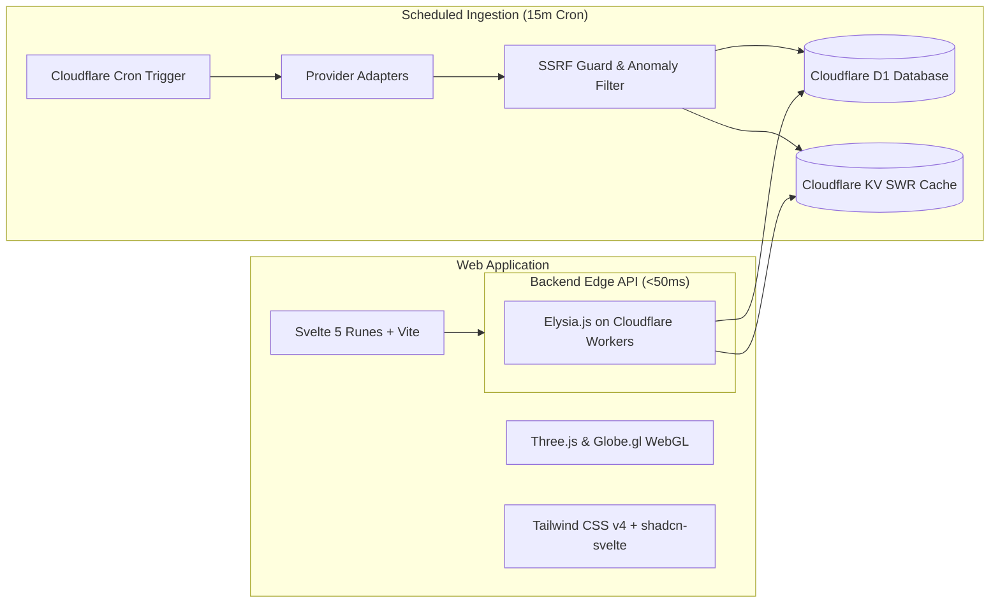

# 🌐 Buanasphere (`buanasphere`)

[](https://github.com/rafliiar17/buanasphere/actions)
[](https://www.typescriptlang.org/)
[](https://bun.sh)
[](https://workers.cloudflare.com/)
[](https://elysiajs.com)
[-FF3E00.svg)](https://svelte.dev)
[](LICENSE)

> **Platform Geospatial 3D Multi-Aplikasi Planet Bumi & Real-Time Intelligence**  
> *"Eksplorasi Data Dunia Real-Time Tanpa Hambatan"* — Menyediakan observatorium data bumi 3D interaktif mencakup nilai tukar valas, waktu diurnal, koridor remitansi diaspora, mobilitas paspor, biodiversitas alam, dan aktivitas seismik global (<50ms Edge Latency di [globe.arafz.id](https://globe.arafz.id)).

---

## 📌 Daftar Isi

- [Tentang Buanasphere](#-tentang-buanasphere)
- [Ekosistem 7 Micro-Apps Interaktif](#-ekosistem-7-micro-apps-interaktif)
- [Sumber Data & Kepatuhan Atribusi](#-sumber-data--kepatuhan-atribusi)
- [Arsitektur & Tech Stack](#-arsitektur--tech-stack)
- [Struktur Monorepo](#-struktur-monorepo)
- [Panduan Memulai (Getting Started)](#-panduan-memulai-getting-started)
- [Pengujian & Standar Kualitas](#-pengujian--standar-kualitas)
- [Keamanan & Ingestion Guard](#-keamanan--ingestion-guard)
- [Penafian Hukum (Disclaimer)](#-penafian-hukum-disclaimer)
- [Tautan Resmi](#-tautan-resmi)
- [Lisensi](#-lisensi)

---

## 📖 Tentang Buanasphere

**Buanasphere** adalah platform observatorium geospatial 3D multi-aplikasi berbasis edge computing yang dirancang untuk menyajikan data planet bumi secara real-time, transparan, dan interaktif.

### 💡 Filosofi & Arti Nama
- **Asal Nama**: Kata **Buana** *(Bahasa Sanskerta/Indonesia: Jagad Raya / Benua / Alam Semesta)* dipadukan dengan **Sphere** *(Lingkup Bola 3D Planet Bumi)*.
- **"Informasi Dulu, Transaksi Belakangan"**: Menyajikan data jujur tanpa paywall, tanpa registrasi wajib, dan tanpa bias komersial.
- **Konteks Indonesia Berwawasan Global**: Mengutamakan perspektif Indonesia (IDR & WIB) sebagai jangkar koordinat dengan cakupan 195+ negara berdaulat di seluruh dunia.
- **Edge-First & Sub-50ms Response**: Didukung Cloudflare Workers, Cloudflare D1, dan Stale-While-Revalidate (SWR) cache pada Cloudflare KV.
- **Zero Layout Shift (Zero CLS)**: Menggunakan Svelte 5 (Runes) dan skeleton shimmer presisi untuk performa rendering yang mulus.

---

## 🌍 Ekosistem 7 Micro-Apps Interaktif

Buanasphere menggunakan arsitektur *plug-and-play micro-apps* yang memungkinkan pengguna beralih konteks visualisasi 3D secara instan:

| Icon | Micro-App | Path | Deskripsi & Fitur Utama |
|---|---|---|---|
| 💱 | **Kurs World** | `/kurs` | Nilai tukar 195+ mata uang vs IDR, matriks perbandingan multi-bank (BI, BCA, Mandiri, BNI, BRI, CIMB), converter instan, & grafik tren historis. |
| ☀️ | **TimeWorld** | `/time` | Model pencahayaan surya diurnal 8-fase global, pelacak siang/malam real-time, jam kerja aktif, dan selisih waktu relatif WIB. |
| ✈️ | **Flow Corridors** | `/flight` | Visualisasi 3D koridor penerbangan remitansi dan pergerakan modal devisa diaspora buruh migran menuju Indonesia. |
| 🛂 | **Passport World** | `/passport` | Indeks mobilitas paspor global & matriks visa bagi WNI (bebas visa, visa on arrival, eVisa, visa required). |
| 🌿 | **Nature World** | `/nature` | Pemetaan biodiversitas, satwa ikonik, flora endemik, dan status konservasi IUCN di 17 negara megadiverse & global bioma. |
| 🏛️ | **World Capitals** | `/capitals` | 195+ ibukota berdaulat, tahun berdirinya negara, asal kemerdekaan, dan pemutar audio lagu kebangsaan resmi. |
| 🌋 | **Earthquake Tracker** | `/quake` | Pemantauan aktivitas seismik global & Indonesia terbaru (M4.5+), kedalaman hiposentrum, peringatan tsunami, dan gelombang episentrum 3D beranimasi. |
| 🛡️ | **Nimda Console** | `/nimda` | Konsol operasional edge yang dilindungi kunci rahasia untuk force ingest, purge KV cache, karantina rate anomali, & manajemen developer API key. |

---

## 🏛 Sumber Data & Kepatuhan Atribusi

Buanasphere mengumpulkan data secara berkala dari sumber-sumber resmi dan tepercaya:

| Kategori Penyedia | Sumber / Provider | Deskripsi Data | URL Resmi |
|---|---|---|---|
| **Pasar Global / Benchmark** | **ExchangeRate-API** | Kurs acuan spot valas global untuk 160+ mata uang dunia | [ExchangeRate-API](https://www.exchangerate-api.com) |
| **Bank Sentral** | **Bank Indonesia (JISDOR)** | Jakarta Interbank Spot Dollar Rate & Kurs Transaksi BI | [bi.go.id](https://www.bi.go.id) |
| **Bank Komersial** | **Bank Central Asia (BCA)** | Kurs e-Rate & Banknotes BCA | [bca.co.id](https://www.bca.co.id) |
| **Bank Komersial** | **Bank Mandiri** | Kurs Transaksi & Special Rate Mandiri | [bankmandiri.co.id](https://www.bankmandiri.co.id) |
| **Bank Komersial** | **Bank Rakyat Indonesia (BRI)** | Kurs e-Rate & Counter Rate BRI | [bri.co.id](https://bri.co.id) |
| **Bank Komersial** | **Bank Negara Indonesia (BNI)** | Kurs Special Rate & Banknotes BNI | [bni.co.id](https://www.bni.co.id) |
| **Bank Komersial** | **CIMB Niaga** | OCTO Clicks & Special Rate CIMB Niaga | [cimbniaga.co.id](https://www.cimbniaga.co.id) |
| **Money Changer** | **DolarAsia** | Kurs fisik / banknotes money changer terverifikasi | [dolarasia.com](https://dolarasia.com) |
| **Seismik & Gempa** | **USGS & BMKG Feed** | Data gempa global M4.5+ & kegempaan Indonesia | [usgs.gov](https://earthquake.usgs.gov) |

---

## 🛠 Arsitektur & Tech Stack



### Rincian Teknologi:
- **Runtime & Package Manager**: [Bun](https://bun.sh) **v1.4+ (Mandatory / Wajib)**
- **Backend Framework**: [Elysia.js](https://elysiajs.com) (TypeScript on Cloudflare Workers)
- **Database & ORM**: [Cloudflare D1](https://developers.cloudflare.com/d1/) + [Drizzle ORM](https://orm.drizzle.team/)
- **Edge Cache**: [Cloudflare KV](https://developers.cloudflare.com/kv/) (Stale-While-Revalidate SWR)
- **Frontend Framework**: [Svelte 5](https://svelte.dev) dengan paradigma modern Runes (`$state`, `$derived`, `$props`, `$effect`)
- **3D Geospatial Engine**: [Three.js](https://threejs.org/) & [Globe.gl](https://globe.gl/) dengan custom shader LUT picking
- **Styling & Komponen**: [Tailwind CSS v4](https://tailwindcss.com), [shadcn-svelte (Bits UI)](https://shadcn-svelte.com), [Lucide Svelte](https://lucide.dev)
- **CLI & Deployment**: [Wrangler](https://developers.cloudflare.com/workers/wrangler/) + [RTK (Rust Token Killer)](https://github.com/)

---

## 📂 Struktur Monorepo

```
buanasphere/
│
├── backend/                        # Elysia.js Backend on Cloudflare Workers
│   ├── src/
│   │   ├── domain/                 # Domain entities (Rate, Provider, Alert, APIKey)
│   │   ├── provider/               # Ingest Adapters (OpenERApi, BI, BCA, Mandiri, dll.)
│   │   ├── service/                # Business logic (Aggregator, Converter, Comparator)
│   │   ├── routes/                 # Elysia routes (/rates, /convert, /history, /nimda)
│   │   ├── middleware/             # Admin auth, Rate limiter, CORS, Error handler
│   │   └── index.ts                # Cloudflare Worker Entrypoint
│   ├── tests/                      # Unit & integration tests (Bun test)
│   ├── wrangler.jsonc              # Cloudflare Workers configuration
│   └── package.json
│
├── frontend/                       # Svelte 5 + Vite Web Application
│   ├── src/
│   │   ├── lib/
│   │   │   ├── components/         # Reusable UI, AboutModal, Navbar, Footer
│   │   │   ├── framework/geoglobe/ # Pluggable 3D Globe Micro-App Architecture
│   │   │   │   ├── plugins/        # Micro-app plugins (kurs, time, flight, passport, nature, capitals, quake)
│   │   │   │   ├── data/           # Modular Geo datasets
│   │   │   │   └── geoStore.svelte # Svelte 5 global geospatial reactive state
│   │   │   └── features/           # Matrix, Converter, Chart, Map, RateCard, Admin
│   │   ├── App.svelte              # Root application component
│   │   └── app.css                 # Tailwind CSS v4 design tokens
│   ├── tests/                      # Frontend unit & component tests
│   └── package.json
│
├── docs/                           # Dokumentasi terstruktur
│   ├── adr/                        # Architecture Decision Records (0001-0048)
│   ├── specs/                      # PRD & Technical Specifications
│   ├── guides/                     # Setup & deployment guides
│   └── reports/                    # Quality verification & security audits
│
├── scripts/                        # Runtime guard & automation scripts
│   └── ensure-bun.ts               # Strict Bun v1.4+ runtime validator
│
├── AGENTS.md                       # Panduan baku AI Agent & SDLC
├── ARCHITECTURE.md                 # Arsitektur sistem & aliran data
├── CONTEXT.md                      # Ubiquitous domain language
├── package.json                    # Root workspace package.json
└── README.md                       # Dokumentasi utama (file ini)
```

---

## 🚀 Panduan Memulai (Getting Started)

### Prasyarat Mutlak:
- ⚡ **[Bun](https://bun.sh) (v1.4+) — WAJIB**:
  ```bash
  curl -fsSL https://bun.sh/install | bash
  bun --version # Wajib >= 1.4.0
  ```

### 1. Kloning Repositori
```bash
git clone https://github.com/rafliiar17/buanasphere.git
cd buanasphere
```

### 2. Instalasi Dependensi
```bash
bun install
```

### 3. Menjalankan Server Lokal
```bash
bun run dev
```
- **Frontend Web**: `http://localhost:5173`
- **Backend API**: `http://localhost:8787`
- **Swagger Documentation**: `http://localhost:8787/swagger`
- **Operator Console**: `http://localhost:5173/nimda`

---

## 🧪 Pengujian & Standar Kualitas

```bash
# Menjalankan seluruh test suite
rtk bun test

# Menjalankan type checking & diagnostics (0 errors, 0 warnings wajib)
rtk bun run check

# Menjalankan production bundle build
rtk bun run build
```

---

## 🔗 Tautan Resmi

- 🌐 **Platform Produksi**: [globe.arafz.id](https://globe.arafz.id)
- 💻 **GitHub Repository**: [github.com/rafliiar17/buanasphere](https://github.com/rafliiar17/buanasphere)
- 📖 **Dokumentasi REST API**: [globe.arafz.id/swagger](https://globe.arafz.id/swagger)
- 🛡️ **Operator Console**: [globe.arafz.id/nimda](https://globe.arafz.id/nimda)

---

## ⚖️ Penafian Hukum (Disclaimer)

Data yang disajikan oleh **Buanasphere** bersifat **informasional dan referensi semata**. Nilai tukar transaksi riil di kantor cabang bank atau money changer dapat berbeda sesuai kebijakan masing-masing penyedia pada waktu transaksi. Buanasphere tidak bertanggung jawab atas keputusan finansial atau kerugian yang timbul dari penggunaan data ini.

---

## 📄 Lisensi

Proyek ini dilisensikan di bawah [MIT License](LICENSE).  
Hak Cipta © 2026 **Buanasphere by Arafz**.
