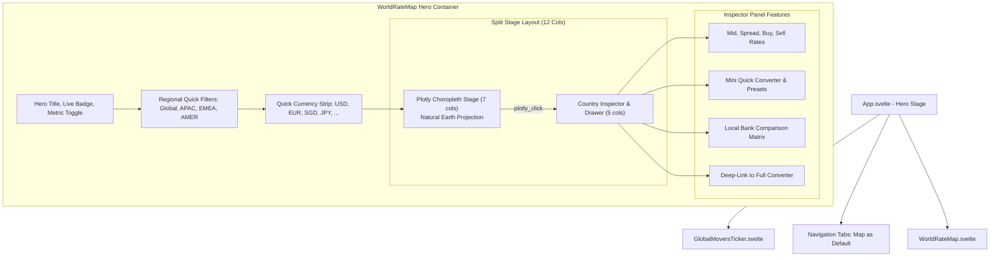

# ADR 0004: Map-Centric Product Architecture and Interactive World FX Map as Flagship Core Identity

> **Status:** Accepted  
> **Tanggal:** 2 September 2026  
> **Deciders:** Core Engineering Team, Subagent 3 (SDLC, QA & Architecture Specialist)  
> **Konteks:** Menjadikan *Interactive World FX Map* sebagai Hero Feature dan Flagship Core Identity platform Kurs World dengan arsitektur visual-first, regional quick filters, dan quick conversion drawer

---

## 1. Konteks & Latar Belakang

Platform `kurs-world` didirikan dengan filosofi dasar *"Informasi Dulu, Transaksi Belakangan"* yang mengutamakan transparansi nilai tukar valuta asing tanpa bias komersial. Pada implementasi awal (Phase 1), antarmuka utama berpusat pada tabel komparasi kurs bank (*Rate Matrix*). Walaupun tabel komparasi memberikan data angka yang detail, pendekatan berbasis tabel memiliki beberapa keterbatasan dalam pengalaman pengguna (*User Experience*):

1. **Kurangnya Daya Tarik Visual & Diferensiasi Produk**: Tabel angka konvensional terlihat serupa dengan portal perbankan tradisional dan tidak mencerminkan identitas modern sebuah platform agregator valas global berbasis edge.
2. **Ketiadaan Konteks Geografis Spasial**: Pengguna (khususnya wisatawan, pelaku ekspor-impor, dan ekspatriat) sering kali berpikir dalam konteks destinasi geografis (contoh: kawasan Asia Tenggara, Zona Euro, Asia Timur, Timur Tengah) sebelum memikirkan kode ticker mata uang spesifik (seperti THB, SGD, EUR, SAR, KRW).
3. **Fragmentasi Alur Kerja (Workflow Friction)**: Pada desain lama, pengguna harus berpindah-pindah tab antara Peta, Tabel Komparasi, dan Kalkulator Konverter untuk melakukan satu tugas sederhana: melihat nilai kurs suatu negara dan langsung menghitung nominal tukarnya.

Untuk menjadikan `kurs-world` sebagai platform rujukan utama kurs valas di Indonesia, diputuskan perombakan arsitektur produk menjadi **Map-Centric Architecture** di mana *Interactive World FX Map* ditempatkan sebagai **Hero Feature & Flagship Core Identity**.

---

## 2. Keputusan Arsitektur

### 2.1 Peta Dunia Interaktif sebagai Hero / Default View
- **Default Active View**: Halaman beranda `App.svelte` secara *default* langsung menampilkan **Peta Kurs Valuta Asing Dunia** (`activeTab = 'map'`) sebagai Hero Stage.
- **Hero Header & Value Proposition**: Banner hero diperbarui untuk mempertegas identitas visual-first dengan penekanan pada agregasi transparan live edge (<50ms).
- **Global Movers Ticker Ribbon**: Komponen pita pergerakan pasar global (`GlobalMoversTicker.svelte`) disematkan di atas tab navigasi untuk memberikan ringkasan instan valas *Top 3 Bullish* (menguat vs IDR), *Top 3 Bearish* (melemah vs IDR), serta valas terpopuler hari ini.

### 2.2 Regional Quick Filters & Auto-Focus
Untuk mempermudah eksplorasi tanpa mengharuskan pengguna melakukan zoom/pan manual secara repetitif, disediakan sistem **Regional Quick Filters**:
- **Global / Seluruh Dunia** (Proyeksi Natural Earth Penuh).
- **Asia Pasifik** (Fokus pada SGD, MYR, THB, JPY, CNY, AUD, KRW, PHP, VND, INR).
- **Eropa & Timur Tengah** (Fokus pada EUR, GBP, CHF, SAR, AED).
- **Amerika & Global** (Fokus pada USD, CAD, BRL).

Ketika filter kawasan dipilih, daftar mata uang cepat (*Quick Currency Strip*) dan proyeksi peta secara cerdas menyesuaikan fokus ke kawasan terkait.

### 2.3 Integrated Country Inspector & Quick Conversion Drawer
Daripada memaksa pengguna berpindah ke tab konverter terpisah, sisi kanan peta dunia (pada layar desktop `lg:col-span-5`) atau bagian bawah (mobile) dilengkapi dengan **Interactive Country Inspector Panel**:
1. **Header Metadata**: Menampilkan bendera negara, nama resmi valas, kode ISO 4217, kode ISO-3 negara, serta badge indikator pergerakan 24 jam.
2. **Live Rates Grid**: Ringkasan Kurs Tengah (Mid Rate), Spread Selisih & Margin %, Kurs Beli (Buy), dan Kurs Jual (Sell).
3. **Kalkulator Konversi Kilat (Quick Mini Converter)**:
   - Input nominal dua arah (Valas -> IDR atau IDR -> Valas via tombol *Tukar Arah*).
   - Tombol preset nominal instan (`1`, `10`, `50`, `100`, `1.000`).
   - Hasil estimasi nilai tukar *real-time* berbasis kurs beli/jual terkini.
4. **Side-by-Side Local Bank Comparison**: Tabel mini komparasi bank nasional (BCA, Bank Mandiri, BI JISDOR, BRI) dengan badge penanda harga beli tertinggi (*Best Buy*) dan harga jual terendah (*Best Sell*).
5. **Seamless Deep-Link CTA**: Tombol *"Buka Konverter Lengkap"* yang menyinkronkan mata uang terpilih ke tab *Full Multi-Source Converter*.

---

## 3. Desain Komponen & Arsitektur Data

---

## 4. Keunggulan & Kepatuhan Standar

1. **Zero CLS & High-Fidelity UX**:
   - `MapSkeleton.svelte` menampilkan state loading beranimasi shimmer presisi selama modul Plotly dimuat di latar belakang.
   - Layout grid 12-kolom terstruktur mempertahankan stabilitas visual tanpa pergeseran elemen (*Cumulative Layout Shift < 0.1*).
2. **Reaktivitas Penuh Svelte 5 (Runes)**:
   - Seluruh interaksi menggunakan paradigma Svelte 5 (`$state()`, `$derived.by()`, `$effect()`, `$props()`).
   - Pembaruan visualisasi peta dilakukan melalui `plotlyModule.react()` yang efisien tanpa memicu re-render DOM berlebih.
3. **Mobile-First & Responsive Lifecycle**:
   - `ResizeObserver` terpasang pada container peta untuk memastikan rendering tetap tajam dan responsif di resolusi mobile, tablet, hingga layar 4K ultrawide.
   - Lifecycle `onDestroy` membersihkan instance Plotly (`Plotly.purge`) dan memutus observer untuk menjamin bebas memory leak.

---

## 5. Konsekuensi

### Positif:
- **Identitas Produk Kuat**: Kurs World memiliki *signature experience* yang membedakannya secara visual dari kompetitor konvensional.
- **Engagement Pengguna Meningkat**: Eksplorasi geografis interaktif membuat pengguna lebih betah berinteraksi dengan platform.
- **Efisiensi Interaksi 3-in-1**: Pengguna dapat melihat visualisasi spasial, memeriksa detail perbankan, dan menghitung nominal valas dalam satu tampilan terpadu.

### Mitigasi:
- **Isolasi Bundle**: Pustaka Plotly diisolasi dalam chunk terpisah melalui dynamic `import('plotly.js-dist-min')` agar tidak membebani initial bundle loading aplikasi utama.
