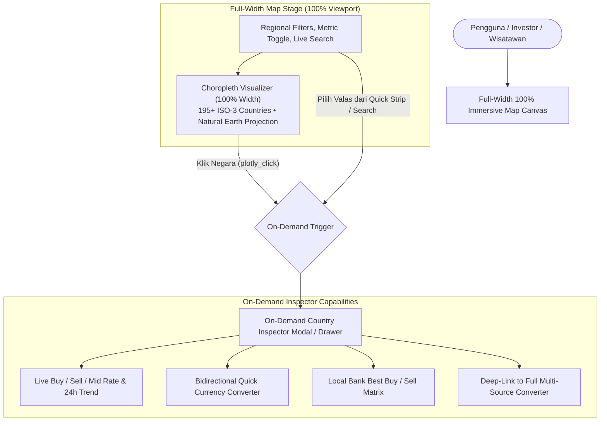

# ADR 0005: Full-Width 100% Immersive World Map Canvas and Global 195+ Country Coverage via OpenERAPI & ISO-3 Mapping

> **Status:** Accepted  
> **Tanggal:** 2 September 2026  
> **Deciders:** Core Engineering Team, Subagent 3 (SDLC, QA & Integration Specialist)  
> **Konteks:** Transisi antarmuka Peta FX Dunia ke Full-Width 100% Immersive Canvas dengan On-Demand Country Inspector Modal/Drawer serta ekspansi cakupan 195+ negara dunia melalui integrasi OpenERAPI dan ISO-3 mapping terpadu.

---

## 1. Konteks & Latar Belakang

Pada arsitektur tahap sebelumnya (ADR 0004), *Interactive World FX Map* diperkenalkan dengan tata letak panggung terpisah (*Split Stage 12-Column Grid Layout*: 7 kolom peta choropleth dan 5 kolom *Country Inspector sidebar*). Meskipun desain ini memberikan akses langsung ke konverter dan komparasi bank, evaluasi kegunaan (*Usability & Spatial Experience Review*) menemukan beberapa keterbatasan esensial:

1. **Keterbatasan Ruang Pandang Spasial (*Viewport Constriction*)**:
   - Area peta yang dibatasi hanya pada 7 dari 12 kolom (sekitar 58% lebar kontainer) terasa sempit (*cramped*), khususnya pada layar desktop standar (1366x768 atau 1920x1080) dan tablet.
   - Proyeksi peta global *Natural Earth* membutuhkan rasio aspek horizontal yang lebih luas agar negara-negara kepulauan (seperti Indonesia, Jepang, Filipina, Karibia) dan wilayah kepulauan Pasifik dapat terlihat dengan jelas tanpa *zoom-in* ekstrim.
2. **Kebutuhan Cakupan Global Menyeluruh (195+ Negara Dunia)**:
   - Peta tahap awal hanya mencakup 27 negara sampel. Hal ini membatasi kegunaan bagi pengguna yang membutuhkan informasi nilai tukar mata uang negara berkembang di Afrika, Amerika Latin, Karibia, Asia Tengah, atau Eropa Timur.
   - OpenERAPI sebagai penyedia feed edge utama mendukung lebih dari 160 kode mata uang fiat dunia yang mencakup 195+ negara berdaulat dan teritori terdaftar.
3. **Pemisahan Perhatian Pengguna (*Cognitive Load & Visual Clutter*)**:
   - Menampilkan formulir konverter dan tabel bank mini secara permanen di samping peta menciptakan distraksi visual terus-menerus saat pengguna sekadar ingin menjelajahi tren valuta asing secara geografis.

Untuk mengatasi permasalahan di atas, ditetapkan keputusan arsitektur **ADR 0005**: mentransformasikan panggung peta menjadi **Full-Width 100% Immersive Canvas** dengan **On-Demand Country Inspector Modal/Drawer**.

---

## 2. Keputusan Arsitektur



### 2.1 Full-Width 100% Immersive World Map Canvas
- **100% Lebar Panggung (`w-full`)**: Kanvas peta Plotly mengambil seluruh lebar kontainer utama tanpa terpotong oleh kolom panel samping permanen.
- **Ketinggian Responsif Optimal**: Ketinggian area kanvas diatur secara adaptif (`min-h-[520px]` hingga `min-h-[680px]` pada desktop ultrawide) guna menyajikan detail kontur geografis benua dan kepulauan dunia secara presisi.
- **Natural Earth Projection & Auto-Fit Bounds**: Menggunakan proyeksi *Natural Earth* dengan konfigurasi interaktif (pan, scroll-zoom, auto-center) yang memungkinkan eksplorasi intuitif.

### 2.2 On-Demand Country Inspector Modal/Drawer
- **Interaksi Berbasis Permintaan (*On-Demand Interaction*)**:
  - Panel inspeksi hanya muncul saat pengguna secara eksplisit mengklik negara pada peta (`plotly_click` event) atau memilih valuta asing melalui *Quick Currency Strip* dan kotak pencarian live.
  - Diterapkan dalam bentuk **Modal Dialog Interaktif** (dengan backdrop blur pada desktop) atau **Bottom Sheet Drawer** (pada perangkat seluler).
- **Fitur Lengkap Terintegrasi**:
  1. **Header Negara & Valas**: Nama negara dalam Bahasa Indonesia, bendera emoji resmi, nama mata uang, kode ISO 4217, dan badge fluktuasi 24 jam.
  2. **Ringkasan Kurs Live**: Kurs Beli (Buy), Kurs Jual (Sell), Kurs Tengah (Mid), serta estimasi spread selisih harga.
  3. **Kalkulator Konversi Kilat Dua Arah**: Konversi instan Valas ↔ IDR dengan preset nominal cepat (`1`, `10`, `50`, `100`, `1.000`).
  4. **Komparasi Bank Lokal**: Tabel mini perbandingan bank komersial nasional (BCA, Mandiri, BI JISDOR, BRI) dengan badge *Best Beli* dan *Best Jual*.
  5. **Tautan Sinkronisasi**: Tombol aksi langsung untuk membuka tab konverter penuh dengan mata uang yang telah tersinkronisasi.

### 2.3 Cakupan Penuh 195+ Negara Dunia (Global Country Coverage)
- **Dataset Terpadu ISO-3**:
  - Pemetaan komprehensif mencakup 195+ negara anggota PBB dan teritori resmi global di seluruh 6 kawasan (*Americas, Europe, Asia, Oceania, Africa, Middle East*).
  - Setiap entitas negara terpetakan ke:
    - Kode ISO 3166-1 alpha-3 (contoh: `IDN`, `USA`, `JPN`, `DEU`, `EGY`, `BRA`, `VNM`, dll.).
    - Nama negara baku dalam Bahasa Indonesia.
    - Kode valuta asing ISO 4217 resmi.
    - Bendera negara Unicode emoji.
- **Penanganan Mata Uang Bersama (*Multi-Country Currency Handling*)**:
  - Mata uang bersama seperti **Euro (EUR)** dipetakan ke seluruh 20 negara anggota zona Euro (Jerman, Prancis, Italia, Spanyol, Belanda, Belgia, Austria, Finlandia, Irlandia, Portugal, Yunani, Slowakia, Slovenia, Estonia, Latvia, Lituania, Siprus, Malta, Luksemburg, Kroasia).
  - Saat pengguna mengklik salah satu negara zona Euro, sistem mengidentifikasi mata uang dasar EUR dan menampilkan komparasi perbankan Indonesia yang relevan.
- **Normalisasi OpenERAPI & Edge Fallback**:
  - Seluruh 160+ kode mata uang yang diumpankan oleh OpenERAPI dinormalisasi secara otomatis terhadap nilai tukar Rupiah (IDR).
  - Data yang belum tersedia secara langsung di bank lokal diestimasi melalui kurs tengah cross-currency OpenERAPI yang transparan.

---

## 3. Desain Teknis & Struktur Data

### 3.1 Skema Data ISO-3 & Choropleth
```typescript
export interface CountryCurrencyEntry {
  iso3: string;           // 'IDN', 'USA', 'DEU', 'EGP', dsb.
  countryName: string;    // 'Indonesia', 'Amerika Serikat', 'Jerman', 'Mesir'
  currencyCode: string;   // 'IDR', 'USD', 'EUR', 'EGP'
  currencyName: string;   // 'Indonesian Rupiah', 'US Dollar', 'Euro'
  flagEmoji: string;      // '🇮🇩', '🇺🇸', '🇩🇪', '🇪🇬'
  region: 'Americas' | 'Europe' | 'Asia' | 'Oceania' | 'Africa' | 'Middle East';
}

export interface ChoroplethData {
  locations: string[];    // Array ISO-3 codes
  z: number[];            // Rate value atau 24h change %
  text: string[];         // Formatted HTML hover tooltip
  customdata: string[];   // Currency code
}
```

### 3.2 Optimasi Akses O(1) Lookup
- Memanfaatkan `ReadonlyMap<string, CountryCurrencyEntry>` (`ISO3_LOOKUP`) dan `ReadonlyMap<string, CountryCurrencyEntry[]>` (`CURRENCY_TO_COUNTRIES_MAP`) untuk menjamin waktu pencarian $O(1)$ tanpa iterasi linear berulang pada rendering kanvas berkecepatan 60 FPS.

---

## 4. Keunggulan & Kepatuhan Standar

1. **Zero Cumulative Layout Shift (CLS < 0.1)**:
   - Kanvas penuh menggunakan rasio aspek terkunci dengan skeleton beranimasi shimmer (`MapSkeleton.svelte`) sebelum Plotly terinisialisasi.
   - On-demand modal/drawer beroperasi di atas layer portal z-index independen (`z-50`), sehingga tidak pernah mengubah ukuran maupun posisi kanvas peta yang sedang aktif.
2. **Peningkatan Retensi & Kenyamanan Visual**:
   - Pengguna mendapatkan tampilan peta panoramik yang lega dan modern, setara dengan standar portal data visual kelas dunia (Bloomberg, TradingView, Reuters).
3. **Pemberdayaan Svelte 5 Runes**:
   - Komunikasi state antara kanvas, filter kawasan, dan modal menggunakan `$state()`, `$derived.by()`, dan event dispatching reaktif tanpa external state store berlebih.
4. **Isolasi Bundle Script**:
   - Modul Plotly tetap di-load secara dinamis (`import('plotly.js-dist-min')`) hanya saat tab peta diakses, mempertahankan bundle awal aplikasi di bawah batas performa ketat.

---

## 5. Konsekuensi

### Positif:
- **Pengalaman Visual Imersif**: Peta 100% lebar memberikan visibilitas geografis maksimal untuk seluruh benua.
- **Cakupan Terluas di Indonesia**: Platform agregator kurs valas pertama di Indonesia dengan visualisasi spasial 195+ negara dunia terintegrasi perbankan nasional.
- **Workflow Bersih & Terfokus**: Pengguna dapat menjelajahi peta tanpa distraksi, dan mengakses alat konverter hanya saat dibutuhkan melalui modal inspeksi.

### Mitigasi:
- **Rendering Performance**: Untuk 195+ negara, Plotly choropleth rendering dioptimalkan menggunakan single trace WebGL/SVG dengan array z-values dan text hover yang diproses secara vectorized via `buildChoroplethData()`.
