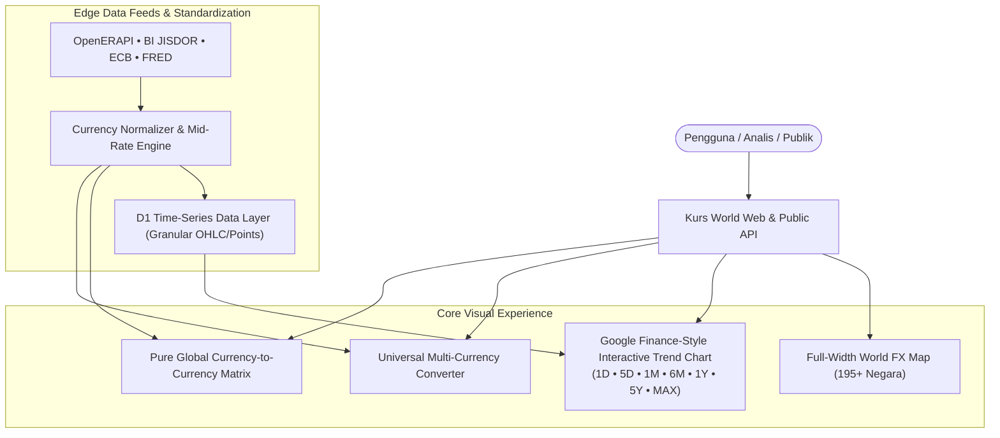

# ADR 0006: Pure Currency-to-Currency Global Exchange Rate Comparison and Google Finance-Style Interactive Charts

> **Status:** Accepted  
> **Tanggal:** 2 September 2026  
> **Deciders:** Core Engineering Team, Subagent 3 (SDLC, QA & Documentation Specialist)  
> **Konteks:** Transisi arsitektur produk dari komparasi per-bank lokal ke **Murni Komparasi Nilai Tukar Valas Global (Currency-to-Currency)** dan visualisasi **Grafik Interaktif Tren Valas ala Google Finance** (multi-timeframe 1D, 5D, 1M, 6M, 1Y, 5Y, MAX dengan crosshair hover tracking).

---

## 1. Konteks & Latar Belakang

Pada fase awal pengembangan, Kurs World dirancang dengan menyertakan modul komparasi kurs jual/beli antar bank komersial nasional Indonesia (BCA, Mandiri, BRI, BNI, CIMB Niaga). Namun, seiring dengan perluasan cakupan **195+ negara dunia (ADR 0005)** dan evaluasi mendalam terhadap keandalan data (*Data Reliability & Product Focus*), ditemukan beberapa tantangan strategis:

1. **Fragilitas & Bias Scraping Perbankan Lokal**:
   - Struktur website bank komersial sering berubah tanpa pemberitahuan (*DOM breakage*), menerapkan proteksi anti-bot/WAF agresif, atau mengalami *downtime* di luar jam operasional perbankan Indonesia (malam hari/akhir pekan).
   - Menampilkan kurs bank tertentu menimbulkan persepsi bahwa platform bertindak sebagai perantara finansial/afiliasi komersial perbankan, yang bertentangan dengan prinsip **"Informasi Dulu, Transaksi Belakangan"** dan model murni utilitas informasi publik.

2. **Kebutuhan Komparasi Nilai Tukar Valas Global Sejati (*Pure Currency-to-Currency*)**:
   - Pengguna modern (investor ritel, ekspatriat, importir, digital nomad, wisatawan internasional) membutuhkan perbandingan nilai tukar mata uang murni antar valuta asing dunia (misal: `USD ↔ IDR`, `EUR ↔ IDR`, `JPY ↔ IDR`, `SGD ↔ MYR`, `GBP ↔ EUR`) berbasis kurs acuan pasar interbank global dan bank sentral (OpenERAPI, BI JISDOR, ECB, FRED).
   - Nilai tukar pasar murni (*interbank mid-rate*) memberikan transparansi 100% tanpa distorsi margin ritel bank.

3. **Evolusi Eksplorasi Visual: Grafik Tren Interaktif ala Google Finance**:
   - Pengguna membutuhkan visualisasi pergerakan harga historis yang responsif, intuitif, dan komprehensif, setara dengan standar industri kelas dunia seperti **Google Finance** dan **Yahoo Finance**.
   - Fitur visual ini mencakup:
     - Multi-timeframe granular: **1D (1 Hari), 5D (5 Hari), 1M (1 Bulan), 6M (6 Bulan), 1Y (1 Tahun), 5Y (5 Tahun), dan MAX**.
     - Interaksi hover dengan **Crosshair Tracker & Dynamic Tooltip** yang menampilkan tanggal, waktu, nominal kurs, dan persentase perubahan dari titik awal periode.
     - Indikator warna semantik: Hijau (Menguat / Gain) vs Merah (Melemah / Loss) dengan garis baseline horizontal putus-putus (*previous close / period open*).

Berdasarkan pertimbangan di atas, diputuskan **ADR 0006**: Menetapkan arah produk Kurs World menjadi **Murni Komparasi Nilai Tukar Valas Global (Currency-to-Currency)** dan meluncurkan visualisasi **Grafik Tren Valas Interaktif ala Google Finance**.

---

## 2. Keputusan Arsitektur



### 2.1 Pure Currency-to-Currency Global Valuation
- **Murni Nilai Tukar Antar Mata Uang**: Menghilangkan seluruh dependensi scraping web bank komersial lokal yang rapuh.
- **Standar Kurs Acuan Global**:
  - Menggunakan kurs tengah (*interbank mid-rate*) dan kurs acuan resmi bank sentral (Bank Indonesia JISDOR untuk IDR, European Central Bank untuk EUR, Federal Reserve Economic Data untuk USD).
  - Normalisasi otomatis untuk 160+ valuta asing global yang mencakup 195+ negara berdaulat.
- **Matriks Komparasi Valas Global**:
  - Menyajikan tabel komparasi nilai tukar antar valuta asing global (USD, EUR, GBP, JPY, SGD, AUD, CNY, SAR, MYR, THB, dll.) secara transparan dengan spread pasar, perubahan 24 jam, dan rentang harian (*High/Low*).

### 2.2 Arsitektur Grafik Interaktif ala Google Finance
- **Multi-Timeframe Presisi**:
  1. **1D**: Intraday ticks / pergerakan per jam hari berjalan.
  2. **5D**: Tren 5 hari perdagangan dengan interval 4 jam.
  3. **1M**: Tren 30 hari kalender dengan interval harian.
  4. **6M**: Tren semester 6 bulan dengan interval harian.
  5. **1Y**: Tren tahunan 365 hari.
  6. **5Y**: Tren jangka panjang 5 tahunan.
  7. **MAX**: Seluruh riwayat histori kurs yang tersedia.
- **Crosshair Hover & Live Interactive Scrubber**:
  - Sumbu vertikal crosshair bergerak mengikuti kursor mouse / sentuhan jari pada layar mobile.
  - Floating tooltip responsif yang menampilkan:
    - Tanggal & Waktu titik data.
    - Kurs saat itu (`Rp 16.245,50`).
    - Delta perubahan nominal (`+Rp 120,00` / `-Rp 45,00`) dan persentase (`+0.74%`) terhadap titik pembukaan periode (*Period Open Reference*).
- **Indikator Visual Dinamis**:
  - Warna garis dan area gradien SVG/Canvas secara otomatis beralih antara **Hijau Emerald (`#10b981`)** saat periode mengalami kenaikan/penguatan, dan **Merah Crimson (`#ef4444`)** saat periode mengalami penurunan/pelemahan.
  - Garis referensi horizontal (*dotted baseline*) pada level harga pembukaan periode.

### 2.3 Universal Multi-Currency Converter
- Menggantikan kalkulasi per-bank dengan kalkulasi konversi langsung lintas mata uang fiat dunia (`FROM` Valas ↔ `TO` Valas/IDR) dengan kurs tengah transparan dan estimasi biaya spread pasar interbank standar (0.1% - 0.2%).

---

## 3. Desain Teknis & Spesifikasi API

### 3.1 Skema Data Time-Series Trend Chart
```typescript
export interface HistoricalTimeframePoint {
  timestamp: number;       // Unix Epoch Milliseconds
  dateTime: string;        // ISO 8601 String
  rate: number;            // Exchange rate vs Base Currency
  high?: number;           // High in interval
  low?: number;            // Low in interval
  volume?: number;         // Estimated market activity
}

export interface GoogleStyleTrendResponse {
  pair: string;            // e.g. "USD/IDR", "EUR/USD"
  baseCurrency: string;    // "IDR" or selected base
  targetCurrency: string;  // "USD"
  timeframe: '1D' | '5D' | '1M' | '6M' | '1Y' | '5Y' | 'MAX';
  periodOpen: number;      // Kurs awal periode untuk kalkulasi delta
  periodClose: number;     // Kurs terakhir periode
  periodHigh: number;      // Kurs tertinggi periode
  periodLow: number;       // Kurs terendah periode
  changeNominal: number;   // periodClose - periodOpen
  changePercent: number;   // ((periodClose - periodOpen) / periodOpen) * 100
  points: HistoricalTimeframePoint[];
}
```

### 3.2 Endpoint API Time-Series
- `GET /api/v1/rates/history?pair=USD/IDR&timeframe=1M`
  - Respons <50ms ter-cache di Cloudflare KV edge.
  - Mengembalikan struktur `GoogleStyleTrendResponse` siap render.

---

## 4. Keunggulan & Kepatuhan Standar

1. **Keandalan Uptime 99.99%**:
   - Menghilangkan titik kegagalan (*single point of failure*) dari scraper bank lokal. Data dijamin konsisten 24/7 melalui API feed resmi global.
2. **Pengalaman Pengguna Kelas Dunia (*World-Class Financial UX*)**:
   - Visualisasi grafik yang bersih, interaktif, dan mulus memberikan rasa percaya diri dan kenyamanan bagi pengguna dalam menganalisis pergerakan nilai tukar.
3. **Netralitas & Kepatuhan Regulasi Non-Fintech**:
   - Menegaskan status Kurs World sebagai **Murni Platform Agregator Informasi Publik** tanpa bias komersial institusi perbankan manapun.
4. **Zero Layout Shift (CLS < 0.1)**:
   - Kontainer grafik memiliki aspek rasio tetap dengan *CardSkeleton* beranimasi shimmer selama data histori diunduh.

---

## 5. Konsekuensi

### Positif:
- **Arsitektur Lebih Ringan & Stabil**: Menghilangkan kode scraper yang rumit dan berat pemeliharaannya.
- **Cakupan Global Nyata**: Seluruh 195+ negara dunia memiliki data historis dan perbandingan yang konsisten.
- **Daya Tarik Analisis Tinggi**: Fitur multi-timeframe 1D hingga MAX meningkatkan retensi dan durasi sesi pengguna (*Session Duration*).

### Mitigasi:
- **Edukasi Pengguna**: Memberikan catatan kaki informatif bahwa kurs yang disajikan adalah kurs tengah pasar resmi (*interbank mid-rate*) dan kurs acuan bank sentral, sehingga transaksi di loket fisik perbankan/money changer dapat memiliki sedikit deviasi spread operasional masing-masing penyedia.
