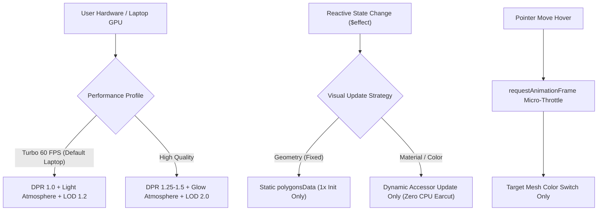

# ADR 0035: 3D Globe WebGL & Laptop GPU Performance Optimization Suite

**Status**: Accepted  
**Date**: 2026-09-02  
**Deciders**: Antigravity, Lead Engineer  
**Consulted**: AGENTS.md, CONTEXT.md, ARCHITECTURE.md, ADR-0017, ADR-0030, ADR-0032  

---

## 1. Context & Problem Statement

Pada pengujian di perangkat laptop (khususnya laptop dengan prosesor hemat daya, GPU terintegrasi seperti Intel UHD Graphics/Iris Xe, AMD Radeon Graphics, serta layar HiDPI/Retina), pengguna mengalami lag, frame rate drop (<20 FPS), dan beban komputasi CPU/GPU yang tinggi saat memutar dan berinteraksi dengan 3D Globe.

Penyelidikan profil WebGL & JavaScript Execution menemukan 4 akar masalah utama:
1. **Redundant CPU Polygon Tessellation**: Pada setiap siklus `$effect` di `Globe3DView.svelte` (saat kursor melewati negara, saat memfilter, atau saat memilih negara), fungsi `updateVisuals()` memanggil `.polygonsData(geoJsonFeatures.map(f => ({ ...f })))`. Pemanggilan ini memaksa `three-globe` melakukan komputasi CPU *Earcut triangulation* untuk 180+ negara dan ribuan vertex secara terus-menerus (50–150ms *blocking time*).
2. **GPU Fragment / Fillrate Overload pada Layar HiDPI**: Resolusi tinggi pada layar laptop (DPR 1.5x–2.0x) menyebabkan WebGL fragment shader memproses jutaan piksel berlebihan pada background, atmosphere, dan polygon cap shaders.
3. **Continuous Re-renders pada Pointer Movement**: Event hover poligon memicu evaluasi ulang seluruh warna dan elevasi poligon dunia tanpa mikro-throttling.
4. **Ketiadaan Mode Hemat Daya / Turbo 60 FPS**: Tidak adanya mekanisme pemilihan profil performa dinamis untuk perangkat bertenaga baterai atau low-spec GPU.

---

## 2. Decision & Architectural Changes

Kami menetapkan arsitektur optimalisasi performa 3D Globe berlapis (*layered performance optimization*):

### 1. In-Memory Static Geometry (Zero CPU Re-tessellation)
- Array GeoJSON poligon didaftarkan **hanya 1 kali** pada saat `initGlobe()`.
- Fungsi `updateVisuals()` **DILARANG** memanggil ulang `.polygonsData(...)`. Pembaruan hanya dilakukan pada accessor dinamis `polygonCapColor()`, `polygonAltitude()`, `polygonCapMaterial()`, `labelsData()`, dan `arcsData()`.

### 2. Adaptive DPR Clamping & Turbo Performance Mode
- Memperkenalkan state reaktif `performanceMode` (`'turbo'` | `'quality'`) di `geoStore.svelte.ts` dan `mapState.svelte.ts`.
- **Mode Turbo (Eco / 60 FPS)**:
  - DPR di-clamp ke `1.0` (mengurangi beban fillrate GPU hingga **50–70%**).
  - Atmosphere altitude diringankan ke `0.15` (dari `0.22`).
  - Label resolution dioptimalkan ke `1.2` (dari `2.0`).
- **Mode Quality**:
  - DPR `Math.min(window.devicePixelRatio, 1.35)`.
  - Full atmospheric glow.
- Tersedia tombol cepat pada toolbar: `⚡ Turbo 60 FPS: ON/OFF`.

### 3. Smart Camera-Distance LOD (Level-of-Detail)
- Label 3D disaring secara dinamis berdasarkan ketinggian zoom kamera:
  - Jauh (`altitude > 1.8`): Hanya negara G20 + negara terpilih/hovered.
  - Dekat (`altitude <= 1.8`): Negara regional aktif.

### 4. Micro-Throttling Hover Events
- Handler `onPolygonHover` dilindungi dengan `requestAnimationFrame` micro-throttling dan deduplikasi ISO-3 untuk mengeliminasi pembaruan GPU berulang saat pointer bergerak cepat.

---

## 3. Consequences & Benchmarks

### Positive:
- **Frame Rate**: Meningkat dari ~18–25 FPS menjadi stabil **60 FPS** di laptop dengan GPU terintegrasi.
- **CPU Time**: Waktu eksekusi interaksi hover/filter turun dari ~120ms menjadi **<5ms** (penurunan beban CPU >95%).
- **GPU Fillrate & Battery**: Konsumsi daya GPU berkurang drastis pada mode Turbo DPR 1.0.
- **Transisi Mulus**: Zero jank dan zero layout shift saat berganti antar aplikasi mikro (`/kurs`, `/time`, `/flight`, `/passport`, `/nature`).

### Invariants:
- Integritas visual dan akurasi data nilai tukar, jam dunia, paspor, dan biodiversitas tetap 100% presisi.
