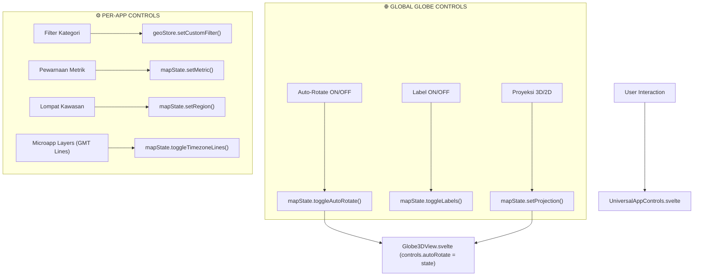

# ADR 0051: Global Globe Controls vs Per-App Microapp Controls Hierarchy Architecture

- **Status**: Accepted
- **Date**: 2026-09-03
- **Author**: Antigravity AI & Maintainers
- **Context**: `UniversalAppControls.svelte`, `mapState.svelte.ts`, `geoStore.svelte.ts`, `Globe3DView.svelte`

---

## 1. Context & Problem Statement

Sebelumnya, panel kontrol mengambang (`UniversalAppControls.svelte`) mencampurkan seluruh kontrol visual bola dunia bersama dengan kontrol domain data microapp tanpa pemisahan visual dan konseptual yang jelas. Pengguna mendapati bahwa tombol proyeksi (Globe 3D vs Datar), tombol label negara (Label ON/OFF), dan kontrol viewport globe lainnya bercampur baur dengan tombol filter kategori microapp serta pewarnaan metrik spesifik data.

Secara ergonomi antarmuka visual geospatial (GIS / WebGL Earth Viewer), kontrol pada platform ini memiliki dua domain tanggung jawab yang berbeda:
1. **Global Globe Controls**: Kontrol yang mengendalikan lingkungan rendering 3D dan viewport secara universal lintas microapp (proyeksi 3D/2D, label negara, rotasi bumi otomatis / auto-rotate).
2. **Per-App Microapp Controls**: Kontrol yang sepenuhnya diatur oleh plugin microapp aktif (filter kategori data, pewarnaan metrik poligon, tombol lompat kawasan/preset kamera, dan layer khusus seperti garis meridian zona waktu).

---

## 2. Decision & Architectural Separation

Diputuskan untuk merefaktor `UniversalAppControls.svelte` dan state manager `mapState.svelte.ts` / `geoStore.svelte.ts` dengan arsitektur hierarkis dua seksi:

### A. Global Globe Controls (`TAMPILAN GLOBE`)
- **Proyeksi Viewport**: Switch 🌍 Globe 3D vs 🗺️ Datar (Flat Map Projection).
- **Label Lapisan Kartografis**: Toggle 👁️ Label: ON / OFF dengan highlight kontras tinggi.
- **Rotasi Otomatis (Auto-Rotation)**: Toggle 🔄 Rotasi: ON / OFF memanfaatkan `OrbitControls.autoRotate` bawaan Three.js/Globe.gl dengan kecepatan lambat stabil (`autoRotateSpeed = 0.6` ~0.6 RPM).

### B. Per-App Microapp Controls (`[NAMA MICROAPP]`)
- **Header Seksi**: Menampilkan judul microapp aktif (`activeApp.name`) dengan aksen badge dan ikon terkait.
- **Layer & Fitur Khusus Microapp**: Contohnya toggle garis zona waktu 3D (`🌐 Garis: ON/OFF`) pada microapp `world-time`.
- **Filter & Kategori**: Render polymorphic pills dari `activeApp.filterOptions`.
- **Pewarnaan Metrik**: Render tombol metrik dinamis dari `activeApp.metrics`.
- **Lompat Kawasan (Camera Presets)**: Render preset kamera benua/wilayah dari `activeApp.cameraPresets`.

---

## 3. Data Flow & State Wiring

---

## 4. Consequences & Benefits

- **Kejelasan Kognitif**: Pengguna dapat membedakan secara instan antara pengaturan kanvas globe dan penyaringan data aplikasi.
- **Extensibility**: Setiap plugin baru yang didaftarkan ke `GeoAppRegistry` otomatis mewarisi panel kontrol global tanpa perlu menulis ulang tombol proyeksi, label, dan rotasi.
- **Konsistensi UX**: Mengikuti standar platform geospasial kelas dunia (Mapbox Studio / Cesium / Google Earth Engine).
