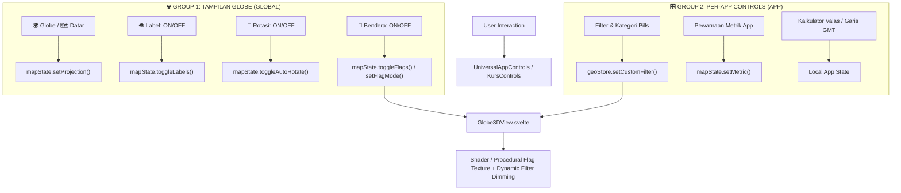

# ADR 0052: Unified Two-Group Floating Controls and Global Flag Mode for Dynamic Filtering

- **Status**: Accepted
- **Date**: 2026-09-03
- **Author**: Antigravity AI & Maintainers
- **Context**: `UniversalAppControls.svelte`, `KursControls.svelte`, `Globe3DView.svelte`, `mapState.svelte.ts`, `geoStore.svelte.ts`

---

## 1. Context & Problem Statement

Pada ADR 0051, panel kontrol mengambang `UniversalAppControls.svelte` telah dibagi menjadi dua seksi: `TAMPILAN GLOBE (Global)` dan `[NAMA MICROAPP] (Per-App)`. Namun demikian, terdapat dua inkonsistensi yang ditemukan oleh pengguna:
1. **Pusat Kontrol Kurs (`KursControls.svelte`) Belum Terintegrasi**: Halaman `/kurs` masih menggunakan format kontrol tunggal lama di mana metrik valas bercampur dengan kontrol proyeksi dan label, tanpa pembagian 2 group yang konsisten dengan microapp lainnya.
2. **Ketiadaan Pilihan Bendera di Seksi Global**: Opsi pewarnaan bendera nasional (`flag`) sebelumnya terkurung sebagai salah satu metrik valas di `/kurs` dan metrik era di `/capitals`. Pengguna menginginkan tombol "🏁 Bendera" menjadi kontrol visual kanvas global universal di semua microapp.
3. **Dynamic Filtering di atas Peta Bendera**: Pengguna menginginkan ketika mode Bendera dinyalakan secara global, sistem filtering dinamis (seperti filter kategori sejarah di `/capitals`, gempa di `/quake`, visa di `/passport`, atau filter mata uang di `/kurs`) tetap berjalan secara dinamis: negara yang memenuhi filter tetap berbendera tajam/terang, sementara negara di luar filter mengalami visual dimming/fade.

---

## 2. Decision & Architecture

### A. Simetri 2x2 pada Seksi 1: 🌐 TAMPILAN GLOBE (Global)
Di seluruh kontrol (`UniversalAppControls` & `KursControls`), Seksi 1 kini memiliki grid 2x2 yang simetris dan konsisten:
- `[ 🌍 Globe 3D / 🗺️ Peta Datar ]` (Proyeksi kanvas)
- `[ 👁️ Label: ON / OFF ]` (Layer kartografi nama negara & ibukota)
- `[ 🔄 Rotasi: ON / OFF ]` (Auto-rotation bumi dengan Three.js OrbitControls)
- `[ 🏁 Bendera: ON / OFF ]` (Universal Flag Mode)

### B. Grouping 2 Seksi pada Seluruh Microapps
Semua komponen kontrol floating distandarisasi ke dalam 2 group:
- **Group 1 (🌐 TAMPILAN GLOBE — GLOBAL)**: Proyeksi, Label, Rotasi, dan Bendera.
- **Group 2 (🎛️ [NAMA APP] — APP SPECIFIC)**:
  - Pada `KursControls`: Pewarnaan Metrik (`🪙 Kurs Nominal` vs `📈 Tren 24h`), Kalkulator Konversi Valas, dan Komparasi Mata Uang.
  - Pada `UniversalAppControls`: Layer spesifik microapp (e.g. Garis Meridian GMT), Filter Kategori pills, Pewarnaan Metrik domain app, dan Lompat Kawasan.

### C. Dynamic Filtering Integration
- Pada `Globe3DView.svelte`, saat mode Bendera aktif (`isFlag = true`):
  - Negara yang cocok dengan filter (`geoStore.isCountryMatched(iso3)`) mempertahankan material bendera procedural atau warna bendera asli dengan opasitas penuh dan elevasi standard.
  - Negara yang tidak cocok dengan filter diturunkan altitudenya (`0.001`) dan diredupkan warnanya/opasitasnya (`dimmed`), memberikan kontras visual dinamis yang memukau bagi pengguna dalam mengeksplorasi data geospasial.

---

## 3. Data Flow

---

## 4. Consequences & Benefits

- Seluruh microapps kini memiliki bahasa visual dan ergonomi kontrol 100% konsisten.
- Pengguna dapat mengeksplorasi bendera seluruh dunia sambil memfilter data geospasial spesifik secara interaktif.
