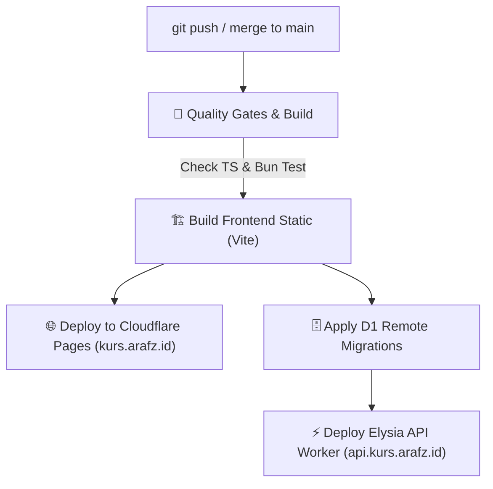

# Cloudflare Auto-Deployment Setup Guide

**Repository:** `rafliiar17/kurs-world`  
**CI/CD Engine:** GitHub Actions (`.github/workflows/deploy.yml`)

---

## 1. Automated Workflow Pipeline

Setiap kali ada perubahan di-push atau di-merge ke branch `main`, GitHub Actions akan menjalankan:



1. **`test-and-build` Job**:
   - Menjalankan `bun run check` (TypeScript type check pada backend & frontend).
   - Menjalankan `bun test` (199 unit & integration tests).
   - Menjalankan `bun run build` (produksi bundle Vite).
   - Mengunggah artifact `frontend-dist`.

2. **`deploy-cloudflare-pages` Job**:
   - Mendownload artifact `frontend/dist`.
   - Melakukan deployment ke Cloudflare Pages (`kurs-world-frontend`).

3. **`deploy-cloudflare-workers` Job**:
   - Mengaplikasikan migrasi D1 remote database (`bun x wrangler d1 migrations apply DB --remote`).
   - Melakukan deployment Elysia backend ke Cloudflare Workers (`kurs-world-api`).

---

## 2. GitHub Secrets Configuration

Berikut 2 secrets yang digunakan oleh GitHub Actions:

| Secret Name | Deskripsi | Status |
|---|---|---|
| `CLOUDFLARE_ACCOUNT_ID` | Cloudflare Account ID (`199b92b58516647d806e121b0f4a34cc`) | ✅ **Terkonfigurasi** |
| `CLOUDFLARE_API_TOKEN` | Cloudflare API Token dengan izin Workers, Pages, D1, KV | ⏳ **Perlu Dibuat** |

---

## 3. Cara Membuat Cloudflare API Token

1. Buka [Cloudflare API Tokens Dashboard](https://dash.cloudflare.com/profile/api-tokens).
2. Klik **Create Token** ➔ pilih template **Edit Cloudflare Workers** atau **Custom Token**.
3. Pastikan token memiliki permissions berikut:
   - **Account** ➔ `Workers Scripts` ➔ `Edit`
   - **Account** ➔ `Workers KV Storage` ➔ `Edit`
   - **Account** ➔ `D1` ➔ `Edit`
   - **Account** ➔ `Cloudflare Pages` ➔ `Edit`
   - **Account** ➔ `Account Settings` ➔ `Read`
4. Set **Account Resources** ke `Include: All accounts` (atau akun spesifik Anda).
5. Klik **Continue to summary** ➔ **Create Token**, lalu salin token yang muncul.
6. Simpan secret ke GitHub repository melalui command:
   ```bash
   rtk gh secret set CLOUDFLARE_API_TOKEN --body "<PASTE_TOKEN_HERE>"
   ```
   Atau via UI di: `https://github.com/rafliiar17/kurs-world/settings/secrets/actions`.

Setelah secret `CLOUDFLARE_API_TOKEN` di-set, setiap push/PR merge ke `main` akan otomatis mendeploy frontend & backend ke Cloudflare tanpa intervensi manual.
