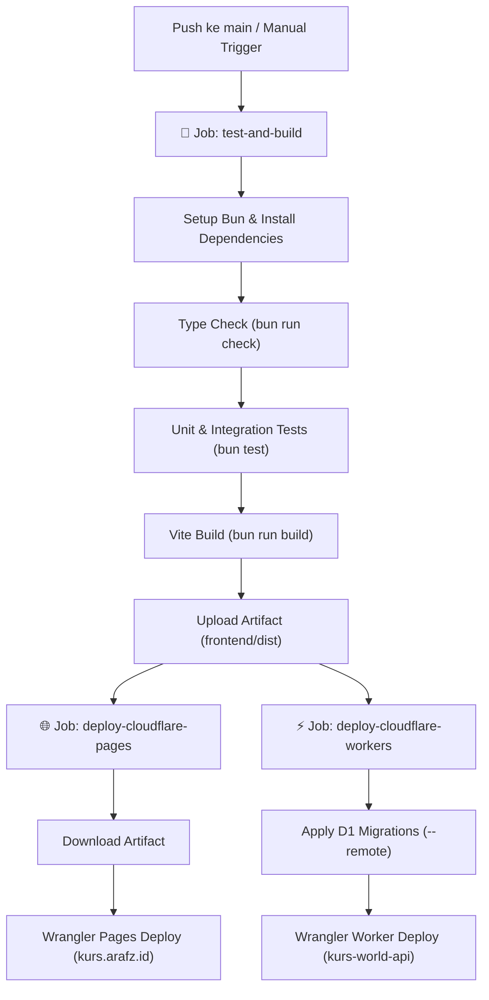

# Panduan Deployment Cloudflare — Kurs World

Dokumen ini menjelaskan tata cara deployment aplikasi **Kurs World** ke infrastruktur **Cloudflare Pages** (Frontend Svelte 5) dan **Cloudflare Workers** (Backend Elysia.js API) secara otomatis melalui GitHub Actions CI/CD maupun manual menggunakan Wrangler CLI.

---

## 1. Arsitektur Deployment & Domain

```
                    ┌────────────────────────┐
                    │      Internet User     │
                    └───────────┬────────────┘
                                │
        ┌───────────────────────┴───────────────────────┐
        ▼                                               ▼
┌───────────────────────────────┐       ┌───────────────────────────────┐
│       Cloudflare Pages        │       │      Cloudflare Workers       │
│      (Frontend Svelte 5)      │       │     (Backend Elysia.js API)   │
│   Domain: kurs.arafz.id       │       │   Domain: api.kurs.arafz.id   │
│   Project: kurs-world-frontend│       │   Worker: kurs-world-api      │
└───────────────┬───────────────┘       └───────────────┬───────────────┘
                │                                       │
                │ Headers: _headers                     ├─► D1 Database (`DB`)
                │ Routing: _routes.json                 ├─► KV Cache (`KURS_CACHE`)
                └───────────────────────────────────────┴─► Cron Trigger (`*/15 * * * *`)
```

---

## 2. Setup GitHub Actions Secrets

Pipeline CI/CD pada [`.github/workflows/deploy.yml`](file:///home/archy/Projects/kurs-world/.github/workflows/deploy.yml) membutuhkan 2 environment secrets di level repository GitHub:

### A. Membuat Cloudflare API Token
1. Buka [Cloudflare Dashboard](https://dash.cloudflare.com/) ➔ **My Profile** ➔ **API Tokens**.
2. Klik **Create Token** ➔ pilih template **Edit Cloudflare Workers** atau **Custom Token**.
3. Berikan permission berikut:
   - **Account** ➔ `Cloudflare Pages`: **Edit**
   - **Account** ➔ `Workers Scripts`: **Edit**
   - **Account** ➔ `Workers KV Storage`: **Edit**
   - **Account** ➔ `D1`: **Edit**
   - **Account** ➔ `Account Settings`: **Read**
   - **Zone** ➔ `DNS`: **Edit** (untuk routing custom domain)
4. Tentukan **Account Resources** dan **Zone Resources** ke akun/domain Anda (`arafz.id`).
5. Klik **Continue to summary** ➔ **Create Token** ➔ Salin nilai token tersebut.

### B. Menemukan Cloudflare Account ID
1. Pada Cloudflare Dashboard, pilih domain Anda atau menu **Workers & Pages**.
2. Di sidebar sebelah kanan, salin **Account ID** (32 karakter heksadesimal).

### C. Mendaftarkan Secrets di GitHub Repository
1. Buka repository GitHub `kurs-world` ➔ **Settings** ➔ **Secrets and variables** ➔ **Actions**.
2. Klik **New repository secret**:
   - Name: `CLOUDFLARE_API_TOKEN`, Value: `<API_TOKEN_ANDA>`
   - Name: `CLOUDFLARE_ACCOUNT_ID`, Value: `<ACCOUNT_ID_ANDA>`
3. Klik **Add secret**.

---

## 3. Provisioning Cloudflare D1 & KV (Setup Awal)

Sebelum melakukan deploy pertama kali, siapkan resource database D1 dan KV namespace di Cloudflare:

### A. Buat Database D1
```bash
# Di root atau folder backend/
cd /home/archy/Projects/kurs-world/backend

# Buat database D1
rtk wrangler d1 create kurs-world-db
```
*Salin output `database_id` yang dihasilkan, lalu masukkan ke [`backend/wrangler.jsonc`](file:///home/archy/Projects/kurs-world/backend/wrangler.jsonc) pada field `database_id`.*

### B. Buat KV Namespace untuk Caching
```bash
# Buat namespace KV untuk cache nilai kurs & metadata negara
rtk wrangler kv:namespace create KURS_CACHE
```
*Salin output `id` yang dihasilkan, lalu masukkan ke [`backend/wrangler.jsonc`](file:///home/archy/Projects/kurs-world/backend/wrangler.jsonc) pada field `id` di bawah `kv_namespaces`.*

---

## 4. Konfigurasi Custom Domain

### A. Frontend: `kurs.arafz.id` (Cloudflare Pages)
1. Di Cloudflare Dashboard, navigasi ke **Workers & Pages** ➔ **Pages** ➔ **`kurs-world-frontend`**.
2. Masuk ke tab **Custom domains** ➔ klik **Set up a custom domain**.
3. Masukkan domain: `kurs.arafz.id`.
4. Cloudflare akan otomatis mengonfigurasi DNS record CNAME ke project Pages Anda.

### B. Backend API: `api.kurs.arafz.id` (Cloudflare Workers)
1. Di Cloudflare Dashboard, navigasi ke **Workers & Pages** ➔ **Overview** ➔ **`kurs-world-api`**.
2. Masuk ke tab **Settings** ➔ **Triggers** ➔ **Custom Domains**.
3. Klik **Add Custom Domain** ➔ masukkan `api.kurs.arafz.id`.
4. Atau konfigurasi sudah didefinisikan secara deklaratif pada [`backend/wrangler.jsonc`](file:///home/archy/Projects/kurs-world/backend/wrangler.jsonc):
```jsonc
"routes": [
  {
    "pattern": "api.kurs.arafz.id",
    "custom_domain": true
  }
]
```

---

## 5. Konfigurasi Khusus Frontend Cloudflare Pages

### A. Security Headers & Caching (`frontend/public/_headers`)
File [`frontend/public/_headers`](file:///home/archy/Projects/kurs-world/frontend/public/_headers) mengatur:
- **Strict Defense-in-Depth Headers**: CSP, X-Frame-Options: DENY, X-Content-Type-Options: nosniff, HSTS.
- **Static Assets Caching**: `/assets/*` di-cache 1 tahun (`max-age=31536000, immutable`).
- **Flags & GeoJSON Data**: `/flags/*` dan `/data/*` di-cache 24 jam dengan SWR (`stale-while-revalidate=604800`).

### B. SPA Routing Control (`frontend/public/_routes.json`)
File [`frontend/public/_routes.json`](file:///home/archy/Projects/kurs-world/frontend/public/_routes.json) mengatur:
- Include `/*` untuk SPA navigation fallback ke `index.html`.
- Exclude static paths (`/assets/*`, `/flags/*`, `/data/*`, `/favicon.ico`, `/robots.txt`, `/sitemap.xml`) agar disajikan langsung dari edge CDN tanpa invocation function.

---

## 6. Manual Deployment Runbook (via Wrangler CLI)

Jika ingin melakukan deployment manual dari mesin lokal / server:

### A. Deploy Frontend (Cloudflare Pages)
```bash
cd /home/archy/Projects/kurs-world/frontend

# 1. Build bundle produksi
rtk bun run build

# 2. Deploy static folder ke Cloudflare Pages
rtk wrangler pages deploy dist --project-name=kurs-world-frontend --commit-dirty=true
```

### B. Deploy Backend (Cloudflare Workers)
```bash
cd /home/archy/Projects/kurs-world/backend

# 1. Jalankan migrasi D1 remote
rtk wrangler d1 migrations apply DB --remote

# 2. Deploy Elysia.js Worker API
rtk wrangler deploy
```

---

## 7. Otomatisasi CI/CD Pipeline (GitHub Actions)

Alur kerja pada [`.github/workflows/deploy.yml`](file:///home/archy/Projects/kurs-world/.github/workflows/deploy.yml):



### Quality Gates Sebelum Deploy:
- **`bun run check`**: Memastikan tidak ada error tipe Svelte 5 / TypeScript.
- **`bun test`**: Menjalankan seluruh test suite backend dan frontend.
- **`bun run build`**: Memastikan aset frontend dan worker berhasil di-bundle tanpa kegagalan minifikasi.

---

## 8. Verifikasi Pasca-Deploy (Smoke Tests)

Setelah deployment berhasil:
1. **Frontend**: Buka `https://kurs.arafz.id` di browser, periksa tampilan tabel kurs, konverter, dan visualisasi peta 3D.
2. **Backend API Health**: Jalankan `curl https://api.kurs.arafz.id/api/v1/health` ➔ pastikan status `200 OK`.
3. **Rates Endpoint**: Jalankan `curl https://api.kurs.arafz.id/api/v1/rates/latest?base=IDR` ➔ pastikan data kurs diterima.
4. **Cron Ingestion**: Pantau log Workers di Cloudflare Dashboard ➔ Workers & Pages ➔ `kurs-world-api` ➔ Logs untuk memastikan cron trigger 15 menit berjalan normal.
