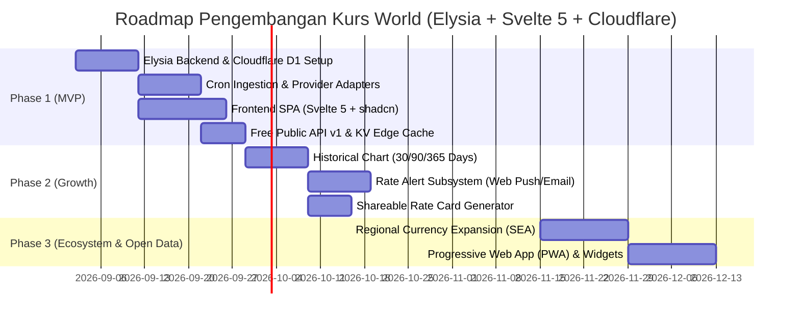

# Product Requirement Document (PRD) — Kurs World

> **Versi:** 1.0-draft  
> **Tanggal:** 2 September 2026  
> **Status:** Siap untuk Review Teknis & SDLC  
> **Referensi:** [docs/brief/BRIEF.md](file:///home/archy/Projects/kurs-world/docs/brief/BRIEF.md), [CONTEXT.md](file:///home/archy/Projects/kurs-world/CONTEXT.md), [ARCHITECTURE.md](file:///home/archy/Projects/kurs-world/ARCHITECTURE.md)

---

## 1. Executive Summary & Visi Produk

**Kurs World** adalah platform informasi nilai tukar mata uang asing (*foreign exchange*) teragregasi yang menyajikan data kurs perbankan dan pasar global secara real-time, transparan, dan komparatif dalam satu antarmuka yang intuitif dan berkinerja tinggi.

Dibangun di atas teknologi serverless modern (**Elysia.js** pada runtime **Cloudflare Workers** dengan frontend **Svelte 5**), platform ini menyajikan response API secepat kilat (<50ms edge cache) dan waktu muat halaman <2.0s LCP dengan efisiensi bundle JavaScript yang sangat ringan.

Filosofi utama: **"Informasi Dulu, Transaksi Belakangan"** — bebas paywall, tanpa registrasi wajib untuk fitur dasar, dan menyajikan perbandingan *side-by-side* bank terbaik untuk kebutuhan jual/beli valuta asing.

---

## 2. Problem Statement & User Personas

### 2.1 Problem Statement
- **Fragmentasi Data**: Pengguna harus membuka 3–5 aplikasi bank secara manual untuk membandingkan selisih (*spread*) kurs.
- **Asimetri Informasi**: Kurs yang ditampilkan search engine (seperti Google/Morningstar) sering kali merupakan kurs tengah pasar grosir interbank, bukan kurs transaksi nyata yang didapatkan nasabah di counter atau e-banking.
- **Ketiadaan Histori Transparan**: Sulit melacak tren histori pergerakan kurs antar bank untuk menentukan timing penukaran optimal.

### 2.2 Target Personas
1. **Raka (28 th, Freelancer Digital)**:
   - Menerima penghasilan dalam USD/EUR setiap bulan.
   - *Goal*: Memantau kurs USD/IDR tertinggi di bank lokal atau fintech sebelum mencairkan dana.
   - *Fitur Kunci*: Rate Alert via browser push saat kurs mencapai threshold tertentu, grafik tren 30 hari.
2. **Ibu Sari (42 th, Pemilik Toko Online & Importir)**:
   - Membayar tagihan supplier dalam CNY/USD secara berkala.
   - *Goal*: Mengetahui bank/money changer dengan kurs jual terendah agar modal belanja lebih hemat.
   - *Fitur Kunci*: Multi-Source Converter dan Shareable Rate Card untuk dikirim ke tim via WhatsApp.
3. **Dimas (30 th, Software Engineer & Startup Integrator)**:
   - Membutuhkan data kurs terkini untuk aplikasi e-commerce atau SaaS multi-currency.
   - *Goal*: Mengakses Public REST API yang stabil, terdokumentasi rapi (Swagger / OpenAPI via Elysia), dengan rate limit memadai.

---

## 3. Product Features & Functional Requirements

### 3.1 FR-1: Real-time Multi-Source Rate Feed
- Mengagregasi kurs setiap 15 menit via Cloudflare Cron Triggers dari provider terdaftar:
  - **Bank Sentral**: Bank Indonesia (`BI`), European Central Bank (`ECB`), FRED.
  - **Bank Komersial**: Bank Central Asia (`BCA`), Bank Mandiri (`MANDIRI`), Bank Rakyat Indonesia (`BRI`), Bank Negara Indonesia (`BNI`), CIMB Niaga (`CIMB`).
- Menampilkan nilai: **Kurs Beli (Buy Rate)**, **Kurs Jual (Sell Rate)**, **Kurs Tengah (Mid Rate)**, dan **Spread**.
- Indikator visual perubahan persentase harian (`+0.15%` / `-0.20%`).

### 3.2 FR-2: Side-by-Side Bank Comparison Matrix
- Tabel komparasi kurs untuk pasangan mata uang terpilih (default: `USD/IDR`, `EUR/IDR`, `SGD/IDR`, `JPY/IDR`, `CNY/IDR`, `AUD/IDR`, `GBP/IDR`, `SAR/IDR`).
- Highlight otomatis:
  - **Best Buy**: Provider dengan kurs beli tertinggi (menguntungkan untuk menjual valas).
  - **Best Sell**: Provider dengan kurs jual terendah (menguntungkan untuk membeli valas).
  - **Lowest Spread**: Provider dengan selisih jual-beli paling tipis.

### 3.3 FR-3: Multi-Source Currency Converter
- Input nominal interaktif dengan format ribuan otomatis.
- Reaktivitas instan via Svelte 5 Runes (`$state`, `$derived`).
- Konversi simultan ke semua Rate Provider dalam satu klik, menampilkan selisih rupiah yang diperoleh antar bank.

### 3.4 FR-4: Historical Trend Charts
- Grafik time-series interaktif (Rentang: 7 Hari, 30 Hari, 90 Hari, 1 Tahun, All-Time).
- Statistik: Open, High, Low, Close (OHLC), dan rata-rata pergerakan kurs.

### 3.5 FR-5: Rate Alert Notification Subsystem
- Pengguna dapat membuat notifikasi peringatan:
  - Format: *“Beri tahu saya jika USD/IDR di BCA menyentuh di bawah Rp 15.500”*.
- Delivery Channel: Web Push API (browser) dan Cloudflare Email Service.

### 3.6 FR-6: Shareable Rate Card
- Generator gambar/snapshot kurs dinamis (OpenGraph / SVG / PNG) beresolusi tajam untuk dibagikan ke WhatsApp, Telegram, atau Twitter/X.

### 3.7 FR-7: 100% Free Public Developer REST API
- Dibangun dengan **Elysia.js** dengan integrasi OpenAPI Swagger (`/swagger`) dan Eden Treaty untuk Type-Safety:
  - `GET /api/v1/rates/latest` — Daftar kurs terkini seluruh pasangan mata uang.
  - `GET /api/v1/rates/compare?pair=USD/IDR` — Tabel komparasi antar bank.
  - `GET /api/v1/convert?from=USD&to=IDR&amount=1000` — Hasil konversi multi-provider.
  - `GET /api/v1/rates/history?pair=USD/IDR&range=30d` — Data histori time-series.
- Autentikasi opsional via API Key Header (`X-API-Key: kw_live_...`) untuk tracking kuota.
- Rate limiting otomatis dengan Cloudflare KV sliding window (Free Tier: 120 req/min per IP / API Key).
- Header Response Informatif: `X-RateLimit-Limit`, `X-RateLimit-Remaining`, `X-RateLimit-Reset`.

### 3.8 FR-8: Informational Disclaimer & Attribution
- Setiap response API dan komponen UI wajib menampilkan disclaimer: *"Informasi kurs publik untuk tujuan referensi, bukan transaksi/investasi"*.
- Atribusi sumber data resmi (Bank Indonesia, BCA, Mandiri, BRI, BNI, CIMB Niaga, ECB).

---

## 4. Non-Functional Requirements (NFR)

| Kategori | Target / Standar |
|---|---|
| **Tech Stack Core** | **Elysia.js (Bun)**, **Cloudflare Workers**, **Svelte 5 (Runes)**, **Cloudflare D1 (Drizzle ORM)**, **Cloudflare KV** |
| **Performa Web** | Largest Contentful Paint (LCP) < 2.0 detik, First Input Delay (FID) < 100ms, Cumulative Layout Shift (CLS) < 0.1 |
| **Performa API** | Cached response latency < 50ms (p95), Cron ingestion cycle < 20 detik |
| **Ketersediaan** | Uptime SLA ≥ 99.5% di seluruh jaringan global Cloudflare |
| **UI/UX Consistency** | Wajib menggunakan komponen resmi `shadcn-svelte` (Bits UI) dengan shimmer skeleton (`animate-shimmer`) pada setiap state loading asinkron |
| **Keamanan** | SSRF prevention pada crawler/scraper, rate limiter per-IP & per-key, sanitasi input query, zero hardcoded credentials |
| **Observability** | Structured JSON Logging, Cloudflare Worker Analytics Engine terintegrasi |

---

## 5. Development Phases & Roadmap

---

## 6. Success Metrics & Key Performance Indicators (KPIs)

- **User Traction**: 5.000 Monthly Active Users (MAU) dalam 3 bulan pertama rilis MVP.
- **Developer Adoption**: 50 developer terdaftar menggunakan Public API v1 pada fase awal.
- **Data Freshness**: Data kurs tidak pernah lebih lama dari 20 menit dari waktu publikasi bank.
- **Error Rate**: API error rate < 0.5%.
