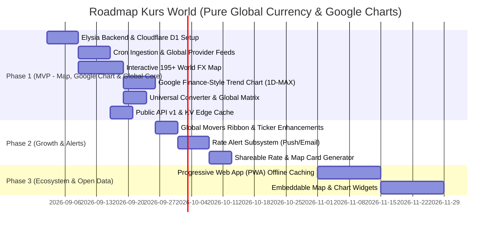

# Product Requirement Document (PRD) — Kurs World

> **Versi:** 2.1-draft  
> **Tanggal:** 2 September 2026  
> **Status:** Siap untuk Review Teknis & SDLC  
> **Referensi:** [docs/brief/BRIEF.md](file:///home/archy/Projects/kurs-world/docs/brief/BRIEF.md), [docs/specs/BRD.md](file:///home/archy/Projects/kurs-world/docs/specs/BRD.md), [docs/adr/0006-google-finance-style-charts-and-pure-currency-comparison.md](file:///home/archy/Projects/kurs-world/docs/adr/0006-google-finance-style-charts-and-pure-currency-comparison.md), [CONTEXT.md](file:///home/archy/Projects/kurs-world/CONTEXT.md), [ARCHITECTURE.md](file:///home/archy/Projects/kurs-world/ARCHITECTURE.md)

---

## 1. Executive Summary & Visi Produk

**Kurs World** adalah platform **Peta Kurs Valuta Asing Dunia Interaktif, Komparasi Nilai Tukar Valas Global & Grafik Finansial ala Google Finance** yang menyajikan visualisasi nilai tukar 195+ negara di dunia dalam satu kanvas visual terintegrasi (*Interactive World FX Choropleth Map & Global Movers*), dipadukan dengan komparasi nilai tukar valas global murni (*Pure Currency-to-Currency Comparison*) dan grafik interaktif multi-timeframe (*1D, 5D, 1M, 6M, 1Y, 5Y, MAX*) dengan crosshair hover tracking.

Dibangun di atas arsitektur serverless modern (**Elysia.js** pada runtime **Cloudflare Workers** dengan frontend **Svelte 5**), platform ini menyajikan respon API secepat kilat (<50ms edge cache) dan waktu muat halaman <2.0s LCP dengan efisiensi bundle JavaScript yang teroptimasi.

Filosofi utama: **"Informasi Dulu, Transaksi Belakangan"** — bebas paywall, tanpa registrasi wajib untuk fitur dasar, menyajikan visual storytelling geografis yang intuitif, serta analisis tren nilai tukar valas objektif tanpa distorsi komersial.

---

## 2. Problem Statement & User Personas

### 2.1 Problem Statement
- **Ketiadaan Visualisasi Geografis FX**: Pengguna tidak memiliki cara visual dan intuitif untuk melihat peta kekuatan mata uang dunia terhadap Rupiah secara makro dan spasial.
- **Ketiadaan Grafik Tren yang Bersih & Cepat**: Sebagian besar platform menyajikan grafik statis atau grafik trading yang terlalu rumit dan lambat dimuat. Pengguna membutuhkan grafik tren yang ringkas, interaktif, dan mudah dibaca layaknya Google Finance.
- **Asimetri Informasi & Distorsi Komersial**: Banyak portal kurs dipenuhi iklan transfer uang atau pinjaman, mengaburkan nilai tukar murni pasar interbank.
- **Ketiadaan Histori Multi-Timeframe Terbuka**: Sulit melacak tren histori pergerakan nilai tukar lintas rentang waktu (1 hari hingga 5 tahun) secara gratis dan instan.

### 2.2 Target Personas & User Stories

#### 1. Raka (28 th, Freelancer Digital)
- **Karakter**: Menerima penghasilan dalam USD/EUR setiap bulan dari klien luar negeri.
- **User Story**: *Sebagai freelancer, saya ingin melihat grafik tren USD/IDR interaktif ala Google Finance (1M & 6M) dan pergerakan 24h valas global agar saya dapat memantau momentum penguatan kurs untuk merencanakan penukaran honor.*
- **Fitur Kunci**: Interactive World FX Map, Google Finance-Style Trend Chart, Rate Alert via push browser/email, Global Movers Ticker.

#### 2. Ibu Sari (42 th, Pemilik Toko Online & Importir)
- **Karakter**: Membayar tagihan supplier bahan baku dalam CNY/JPY secara berkala.
- **User Story**: *Sebagai importir, saya ingin mengeklik negara mitra dagang (China/Jepang) langsung pada peta dunia, melihat grafik tren pergerakan semesteran (6M/1Y), menghitung estimasi belanja via konverter, dan membagikan snapshot kurs ke tim saya via WhatsApp.*
- **Fitur Kunci**: Interactive Map on-demand inspector, Google-Style Trend Chart, Universal Currency Converter, Shareable Rate Card.

#### 3. Dimas (30 th, Software Engineer & Startup Integrator)
- **Karakter**: Membutuhkan data kurs terkini dan time-series timeframes untuk aplikasi e-commerce / SaaS multi-currency.
- **User Story**: *Sebagai developer, saya ingin mengakses Public REST API yang stabil, cepat (<50ms), dan terdokumentasi OpenAPI/Swagger untuk mengambil data kurs negara dan histori time-series valas global.*
- **Fitur Kunci**: Public REST API v1 (`/api/v1/rates/latest`, `/api/v1/rates/history`, `/api/v1/docs`).

---

## 3. Product Features & Functional Requirements (FR)

### 3.1 FR-1: Interactive World FX Choropleth Map (Flagship Hero Feature)
- **Komponen Hero Utama**: Peta choropleth dunia interaktif full-width 100% (Plotly/SVG) yang mencakup 195+ negara berdaulat.
- **Skema Pewarnaan Dinamis**:
  - Warna negara mencerminkan **status pergerakan nilai tukar 24 jam terhadap IDR**:
    - **Hijau**: Mata uang negara tersebut melemah terhadap IDR (Rupiah menguat).
    - **Merah**: Mata uang negara tersebut menguat terhadap IDR (Rupiah melemah).
    - **Abu-abu / Netral**: Tidak ada perubahan signifikan atau data belum terpetakan.
  - Mode toggle alternatif: Pewarnaan berdasarkan skala kurs absolut terhadap IDR.
- **Interaktivitas Peta**:
  - **Hover Tooltip**: Menampilkan kartu ringkas berisi: Bendera negara, Nama negara, Kode mata uang (ISO 4217), Kurs tengah terkini vs IDR, dan Perubahan 24h (`+0.25%`).
  - **Click Action**: Mengeklik negara langsung membuka *On-Demand Country Inspector Modal/Drawer* dengan kalkulator konversi instan dua arah dan ringkasan valas.
  - **Navigasi & Kontrol**: Mendukung Smooth Zoom (+ / -), Pan/Drag, Reset View, serta tombol filter cepat per kawasan (Global, Asia Tenggara, Asia Timur, Asia Selatan, Eropa, Amerika, Timur Tengah, Oseania, Afrika).
  - **Integrated Country Search Bar**: Input pencarian negara/valas yang langsung menyorot negara terpilih.

### 3.2 FR-2: Real-time Multi-Source Global Rate Feed
- Mengagregasi kurs berkala setiap 15 menit via Cloudflare Cron Triggers dari provider resmi:
  - **Global & Central Bank Feeds**: OpenERAPI (160+ valas), Bank Indonesia JISDOR (`BI`), European Central Bank (`ECB`), Federal Reserve (`FRED`).
- Menampung atribut data: Kurs Tengah (*Mid Rate*), Spread Estimasi Pasar Interbank, *24h Change*, *High/Low 24h*.

### 3.3 FR-3: Pure Currency-to-Currency Global Comparison Matrix
- Matriks komparasi nilai tukar antar valuta asing global murni terhadap IDR (USD, EUR, SGD, JPY, CNY, AUD, GBP, SAR, MYR, THB, dll.) dan cross-rates.
- Menampilkan metrik transparan:
  - **Kurs Tengah Pasar (Mid-Rate)**: Nilai tukar interbank bebas markup ritel.
  - **Estimasi Spread Pasar**: Rentang spread wajar pasar grosir (0.1% - 0.2%).
  - **Fluktuasi 24 Jam**: Persentase penguatan/pelemahan harian.
  - **Rentang Harian (Daily Range)**: Titik harga terendah (Low) dan tertinggi (High) dalam 24 jam.

### 3.4 FR-4: Quick Universal Currency Converter
- Kalkulator konversi kilat dua arah lintas mata uang fiat dunia (`FROM` Valas ↔ `TO` Valas/IDR).
- Input nominal interaktif dengan auto-formatting ribuan rupiah (`Rp`) dan tombol preset nominal cepat (`1`, `10`, `50`, `100`, `1.000`).
- Terhubung langsung dengan pilihan negara pada Interactive Map.

### 3.5 FR-5: Global Movers Ticker Ribbon
- **Live Ticker Ribbon**: Pita pergerakan kurs valas utama dunia yang bergerak mulus di bagian atas antarmuka.
- Menampilkan sorotan **Top 3 Gainers** (mata uang yang paling menguat terhadap IDR) dan **Top 3 Losers** (mata uang yang paling melemah terhadap IDR).

### 3.6 FR-6: Google Finance-Style Interactive Charts
- Grafik time-series interaktif dan responsif ala Google Finance dengan multi-timeframe:
  - **1D** (1 Hari), **5D** (5 Hari), **1M** (1 Bulan / 30 Hari), **6M** (6 Bulan), **1Y** (1 Tahun), **5Y** (5 Tahun), dan **MAX**.
- Fitur Interaktif:
  - **Crosshair Hover Tracking**: Garis vertikal penunjuk yang mengikuti posisi kursor/sentuhan.
  - **Dynamic Delta Tooltip**: Menampilkan tanggal/waktu, kurs saat titik tersebut, dan selisih delta nominal serta persentase terhadap kurs pembukaan periode (*Period Open Reference*).
  - **Pewarnaan Semantik Dinamis**: Garis grafik dan area gradien otomatis berwarna Hijau (`#10b981`) saat periode untung/naik dan Merah (`#ef4444`) saat periode rugi/turun.
  - **Baseline Reference**: Garis horizontal putus-putus pada level harga pembukaan periode.

### 3.7 FR-7: Rate Alert Notification Subsystem
- Pengguna dapat membuat notifikasi peringatan ambang batas (*threshold alert*) tanpa registrasi akun rumit:
  - Format contoh: *“Beri tahu saya jika kurs USD/IDR menyentuh di atas Rp 16.500”*.
- Delivery Channel: Web Push API (browser) dan Cloudflare Email Service.

### 3.8 FR-8: Shareable Rate & Map Card
- Generator gambar/snapshot visual kurs dinamis (OpenGraph / SVG / PNG) beresolusi tajam untuk dibagikan ke WhatsApp, Telegram, atau Twitter/X.

### 3.9 FR-9: 100% Free Public Developer REST API
- Dibangun dengan **Elysia.js** dengan integrasi OpenAPI / Scalar Docs (`/api/v1/docs`) dan Eden Treaty untuk Type-Safety:
  - `GET /api/v1/rates/latest` — Daftar kurs terkini seluruh valuta asing dunia.
  - `GET /api/v1/rates/map` — Dataset 195+ negara, kode ISO-3, kurs, dan status warna 24h untuk render peta.
  - `GET /api/v1/rates/matrix` — Matriks komparasi nilai tukar valas global.
  - `GET /api/v1/convert?from=USD&to=IDR&amount=1000` — Hasil konversi universal.
  - `GET /api/v1/rates/history?pair=USD/IDR&timeframe=1M` — Data histori time-series multi-timeframe Google-style.
- Rate limiting otomatis dengan Cloudflare KV sliding window (Free Tier: 120 req/min per IP / API Key).
- Header Response: `X-RateLimit-Limit`, `X-RateLimit-Remaining`, `X-RateLimit-Reset`.

### 3.10 FR-10: Informational Disclaimer & Attribution
- Setiap response API dan antarmuka web wajib menampilkan disclaimer: *"Informasi kurs publik untuk tujuan referensi dan edukasi, bukan instruksi transaksi finansial atau investasi"*.
- Atribusi sumber data resmi (OpenERAPI, Bank Indonesia JISDOR, ECB, FRED).

---

## 4. User Interface (UI) Architecture & Page Flow

```
┌────────────────────────────────────────────────────────────────────────┐
│  [Top Bar] Logo (Kurs.World Beta) | Edge Sync | Public API Link         │
├────────────────────────────────────────────────────────────────────────┤
│  [HERO BANNER] Eksplorasi Kurs Valas Dunia Secara Transparan           │
│  - Tagline & Subtext Pusat Data Agregasi Valas Global                   │
│  - [Button: Pasang Rate Alert Gratis]                                   │
├────────────────────────────────────────────────────────────────────────┤
│  [GLOBAL MOVERS TICKER RIBBON]                                          │
│  ▲ Top Gainers: USD (+0.45%), SGD (+0.32%) | ▼ Top Losers: JPY (-0.51%) │
├────────────────────────────────────────────────────────────────────────┤
│  [NAVIGATION TABS]                                                      │
│  [Peta Kurs Dunia] [Komparasi Kurs Valas] [Kalkulator] [Grafik Tren] [Cards]│
├────────────────────────────────────────────────────────────────────────┤
│                                                                        │
│  [TAB 1: FULL-WIDTH INTERACTIVE WORLD FX MAP]                          │
│  - Regional Quick Filters (Global, ASEAN, Asia Timur, Eropa, dll.)     │
│  - 100% Width Canvas Plotly Choropleth 195+ Negara                      │
│  - On-Demand Modal Inspector: Flag, Live Rates, Quick 2-Way Converter  │
│                                                                        │
│  [TAB 2: PURE GLOBAL CURRENCY COMPARISON MATRIX]                       │
│  - Currency Selector Pills (USD, EUR, SGD, JPY, GBP, CNY, SAR, dll.)  │
│  - Side-by-Side Global Rates, Spread, 24h High/Low, Last Update        │
│                                                                        │
│  [TAB 3: GOOGLE FINANCE-STYLE INTERACTIVE TREND CHARTS]                │
│  - Timeframe Switchers: [1D] [5D] [1M] [6M] [1Y] [5Y] [MAX]            │
│  - Crosshair Hover Tracker & Dynamic Delta Tooltip                     │
│  - Semantic Green/Red SVG Path & Area Fill                             │
│                                                                        │
│  [TAB 4: UNIVERSAL CONVERTER & SHAREABLE CARDS]                        │
│                                                                        │
├────────────────────────────────────────────────────────────────────────┤
│  [EDUCATIONAL & VALUE PROPOSITION STRIP]                               │
│  - Transparansi Tanpa Bias | Edge-First Sub-50ms | Perbandingan Cerdas │
├────────────────────────────────────────────────────────────────────────┤
│  [Footer] Disclaimer Non-Fintech | Atribusi Sumber | Open Data API     │
└────────────────────────────────────────────────────────────────────────┘
```

---

## 5. Non-Functional Requirements (NFR)

| Kategori | Target / Standar |
|---|---|
| **Tech Stack Core** | **Elysia.js (Bun)**, **Cloudflare Workers**, **Svelte 5 (Runes)**, **Cloudflare D1 (Drizzle ORM)**, **Cloudflare KV** |
| **Map & Chart Rendering Performance** | Render Peta Choropleth 195+ negara < 200ms, Render Grafik Tren SVG < 50ms |
| **Web Performance (Core Web Vitals)**| Largest Contentful Paint (LCP) < 2.0 detik, FID < 100ms, Cumulative Layout Shift (CLS) < 0.1 |
| **API Performance** | Cached response latency < 50ms (p95), Cron ingestion cycle < 15 detik |
| **Ketersediaan** | Uptime SLA ≥ 99.9% di seluruh edge network Cloudflare |
| **UI/UX Consistency** | Wajib menggunakan komponen resmi `shadcn-svelte` (Bits UI) dengan shimmer skeleton (`animate-shimmer` / `Skeleton`) pada setiap state loading asinkron |
| **Keamanan** | SSRF prevention pada crawler/fetcher, KV sliding window rate limiter, sanitasi input query, zero hardcoded credentials |
| **Observability** | Structured JSON Logging (Pino/Worker logger), Cloudflare Worker Analytics |

---

## 6. Development Phases & Roadmap



---

## 7. Success Metrics & Key Performance Indicators (KPIs)

- **User Traction**: 10.000 Monthly Active Users (MAU) dalam 3 bulan pertama rilis MVP.
- **Map & Chart Interaction Rate**: ≥ 75% pengunjung berinteraksi (hover/click/crosshair) dengan Interactive World FX Map atau Google-Style Trend Chart.
- **Developer Adoption**: 50 developer terdaftar menggunakan Public API v1 pada fase awal.
- **Data Freshness**: Data kurs diperbarui otomatis tiap 15 menit via edge cron.
- **API Error Rate**: < 0.1%.
