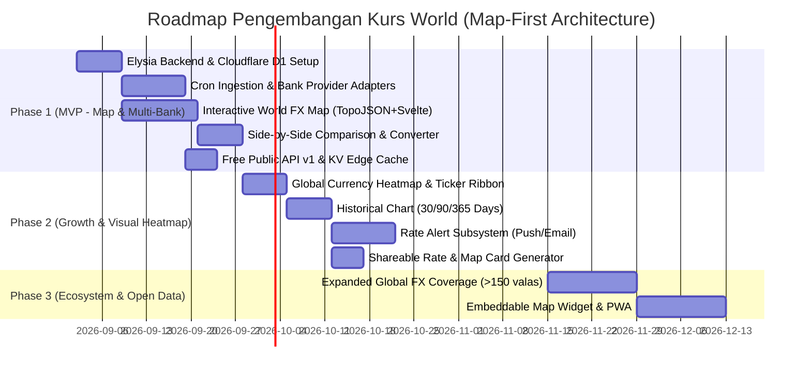

# Product Requirement Document (PRD) — Kurs World

> **Versi:** 2.0-draft  
> **Tanggal:** 2 September 2026  
> **Status:** Siap untuk Review Teknis & SDLC  
> **Referensi:** [docs/brief/BRIEF.md](file:///home/archy/Projects/kurs-world/docs/brief/BRIEF.md), [docs/specs/BRD.md](file:///home/archy/Projects/kurs-world/docs/specs/BRD.md), [CONTEXT.md](file:///home/archy/Projects/kurs-world/CONTEXT.md), [ARCHITECTURE.md](file:///home/archy/Projects/kurs-world/ARCHITECTURE.md)

---

## 1. Executive Summary & Visi Produk

**Kurs World** adalah platform **Peta Kurs Valuta Asing Dunia Interaktif & Agregator FX Multi-Bank** yang menyajikan visualisasi nilai tukar seluruh negara di dunia dalam satu peta visual global terintegrasi (*Interactive World FX Choropleth Map & Global Heatmap*), dipadukan dengan data perbandingan kurs perbankan nasional (BCA, Mandiri, BRI, BNI, CIMB Niaga, BI) secara real-time dan komparatif.

Dibangun di atas arsitektur serverless modern (**Elysia.js** pada runtime **Cloudflare Workers** dengan frontend **Svelte 5**), platform ini menyajikan respon API secepat kilat (<50ms edge cache) dan waktu muat halaman <2.0s LCP dengan efisiensi bundle JavaScript yang sangat ringan (<80KB TopoJSON terkompresi).

Filosofi utama: **"Informasi Dulu, Transaksi Belakangan"** — bebas paywall, tanpa registrasi wajib untuk fitur dasar, menyajikan visual storytelling geografis yang intuitif, serta komparasi *side-by-side* bank terbaik untuk kebutuhan jual/beli valuta asing.

---

## 2. Problem Statement & User Personas

### 2.1 Problem Statement
- **Ketiadaan Visualisasi Geografis FX**: Pengguna tidak memiliki cara visual dan intuitif untuk melihat peta kekuatan mata uang dunia terhadap Rupiah secara makro dan spasial.
- **Fragmentasi Data Perbankan Lokal**: Pengguna harus membuka 3–5 aplikasi bank secara manual untuk membandingkan selisih (*spread*) kurs beli/jual.
- **Asimetri Informasi Search Engine**: Kurs yang ditampilkan Google (Morningstar/Refinitiv) sering kali merupakan kurs tengah pasar grosir interbank, bukan kurs transaksi nyata yang didapatkan nasabah di counter atau e-banking lokal.
- **Ketiadaan Histori Transparan**: Sulit melacak tren histori pergerakan kurs antar bank untuk menentukan timing penukaran optimal.

### 2.2 Target Personas & User Stories

#### 1. Raka (28 th, Freelancer Digital)
- **Karakter**: Menerima penghasilan dalam USD/EUR setiap bulan dari klien luar negeri.
- **User Story**: *Sebagai freelancer, saya ingin melihat peta heatmap global dan pergerakan 24h USD/EUR terhadap IDR, lalu langsung membandingkan kurs beli di bank-bank lokal agar saya dapat mencairkan honor di bank yang memberikan rupiah terbanyak.*
- **Fitur Kunci**: Interactive World FX Map, Rate Alert via browser push, grafik tren 30 hari, Best Buy Rate highlight.

#### 2. Ibu Sari (42 th, Pemilik Toko Online & Importir)
- **Karakter**: Membayar tagihan supplier bahan baku dalam CNY/JPY secara berkala.
- **User Story**: *Sebagai importir, saya ingin mengeklik negara mitra dagang (China/Jepang) langsung pada peta dunia untuk melihat kurs jual terendah di bank lokal, menghitung total belanja via konverter, dan membagikan snapshot kurs ke tim saya via WhatsApp.*
- **Fitur Kunci**: Interactive Map click-to-convert, Side-by-Side Bank Comparison, Multi-Source Converter, Shareable Rate Card.

#### 3. Dimas (30 th, Software Engineer & Startup Integrator)
- **Karakter**: Membutuhkan data kurs terkini dan metadata negara untuk aplikasi e-commerce / SaaS multi-currency.
- **User Story**: *Sebagai developer, saya ingin mengakses Public REST API yang stabil, cepat (<50ms), dan terdokumentasi OpenAPI/Swagger untuk mengambil data kurs negara dan bank komersial Indonesia.*
- **Fitur Kunci**: Public REST API v1 (`/api/v1/rates/latest`, `/api/v1/rates/map`, `/swagger`).

---

## 3. Product Features & Functional Requirements (FR)

### 3.1 FR-1: Interactive World FX Choropleth Map (Flagship Hero Feature)
- **Komponen Hero Utama**: Peta choropleth dunia interaktif berbasis vektor (TopoJSON/SVG ringan) yang terintegrasi tepat di area hero landing page.
- **Skema Pewarnaan Dinamis**:
  - Warna negara mencerminkan **status pergerakan nilai tukar 24 jam terhadap IDR**:
    - **Hijau**: Mata uang negara tersebut melemah terhadap IDR (Rupiah menguat).
    - **Merah**: Mata uang negara tersebut menguat terhadap IDR (Rupiah melemah).
    - **Abu-abu / Netral**: Tidak ada perubahan signifikan atau data belum terpetakan.
  - Mode toggle alternatif: Pewarnaan berdasarkan *Relative Strength Index* terhadap IDR.
- **Interaktivitas Peta**:
  - **Hover Tooltip**: Menampilkan kartu ringkas berisi: Bendera negara, Nama negara, Kode mata uang (ISO 4217), Kurs tengah terkini vs IDR, Perubahan 24h (`+0.25%`), dan Rekomendasi bank lokal terbaik.
  - **Click Action**: Mengeklik negara langsung membuka *Country Quick Drawer* / Floating Card dan secara otomatis memfilter tabel komparasi bank serta menginisialisasi konverter ke mata uang negara tersebut.
  - **Navigasi & Kontrol**: Mendukung Smooth Zoom (+ / -), Pan/Drag, Reset View, serta tombol filter cepat per kawasan (Global, Asia Tenggara, Asia Pasifik, Eropa, Amerika, Timur Tengah, Oseania, Afrika).
  - **Integrated Country Search Bar**: Input pencarian negara/valas di atas peta yang langsung menyorot dan mengarahkan fokus kamera peta ke negara terpilih.

### 3.2 FR-2: Real-time Multi-Source Rate Feed
- Mengagregasi kurs berkala setiap 15 menit via Cloudflare Cron Triggers dari provider resmi:
  - **Bank Sentral**: Bank Indonesia (`BI`), European Central Bank (`ECB`), FRED.
  - **Bank Komersial Nasional**: Bank Central Asia (`BCA`), Bank Mandiri (`MANDIRI`), Bank Rakyat Indonesia (`BRI`), Bank Negara Indonesia (`BNI`), CIMB Niaga (`CIMB`).
- Menampung atribut data: Kurs Beli (*Buy Rate*), Kurs Jual (*Sell Rate*), Kurs Tengah (*Mid Rate*), *Spread*, dan *24h Change*.

### 3.3 FR-3: Side-by-Side Bank Comparison Matrix
- Tabel komparasi kurs untuk pasangan mata uang terpilih (default: `USD/IDR`, `EUR/IDR`, `SGD/IDR`, `JPY/IDR`, `CNY/IDR`, `AUD/IDR`, `GBP/IDR`, `SAR/IDR`, `MYR/IDR`, `THB/IDR`).
- Highlight rekomendasi otomatis:
  - **Best Buy**: Bank dengan kurs beli tertinggi (paling untung untuk menukar valas ke IDR).
  - **Best Sell**: Bank dengan kurs jual terendah (paling hemat untuk membeli valas dengan IDR).
  - **Lowest Spread**: Bank dengan selisih jual-beli paling tipis.

### 3.4 FR-4: Multi-Source & Quick Country Converter
- Input nominal interaktif dengan auto-formatting ribuan rupiah (`Rp`).
- Terhubung langsung dengan pilihan negara pada Interactive Map.
- Menampilkan kalkulasi simultan hasil konversi di setiap bank dalam satu kali input.

### 3.5 FR-5: Global Currency Ticker & Heatmap Grid
- **Live Ticker Ribbon**: Pita pergerakan kurs valas utama dunia yang bergerak mulus di bagian atas antarmuka.
- **Heatmap Grid**: Tampilan kartu ringkas seluruh mata uang dunia dengan pengelompokan performa harian (Top Gainers vs Top Losers vs IDR).

### 3.6 FR-6: Historical Trend Charts
- Grafik time-series interaktif berbasis Lightweight Charts (Rentang: 7 Hari, 30 Hari, 90 Hari, 1 Tahun, All-Time).
- Menampilkan indikator statistik Open, High, Low, Close (OHLC) dan rata-rata pergerakan kurs.

### 3.7 FR-7: Rate Alert Notification Subsystem
- Pengguna dapat membuat notifikasi peringatan threshold tanpa registrasi akun rumit:
  - Format contoh: *“Beri tahu saya jika kurs JPY/IDR di BCA menyentuh di bawah Rp 105”*.
- Delivery Channel: Web Push API (browser) dan Cloudflare Email Service.

### 3.8 FR-8: Shareable Rate & Map Card
- Generator gambar/snapshot visual kurs dinamis (OpenGraph / SVG / PNG) beresolusi tajam untuk dibagikan ke WhatsApp, Telegram, atau Twitter/X.

### 3.9 FR-9: 100% Free Public Developer REST API
- Dibangun dengan **Elysia.js** dengan integrasi OpenAPI Swagger (`/swagger`) dan Eden Treaty untuk Type-Safety:
  - `GET /api/v1/rates/latest` — Daftar kurs terkini seluruh pasangan mata uang.
  - `GET /api/v1/rates/map` — Dataset negara, koordinat, kode ISO, kurs, dan status warna 24h untuk render peta.
  - `GET /api/v1/rates/compare?pair=USD/IDR` — Tabel komparasi antar bank.
  - `GET /api/v1/convert?from=USD&to=IDR&amount=1000` — Hasil konversi multi-provider.
  - `GET /api/v1/rates/history?pair=USD/IDR&range=30d` — Data histori time-series.
- Rate limiting otomatis dengan Cloudflare KV sliding window (Free Tier: 120 req/min per IP / API Key).
- Header Response: `X-RateLimit-Limit`, `X-RateLimit-Remaining`, `X-RateLimit-Reset`.

### 3.10 FR-10: Informational Disclaimer & Attribution
- Setiap response API dan komponen UI wajib menampilkan disclaimer: *"Informasi kurs publik untuk tujuan referensi dan edukasi, bukan instruksi transaksi finansial atau investasi"*.
- Atribusi sumber data resmi (Bank Indonesia, BCA, Mandiri, BRI, BNI, CIMB Niaga, ECB).

---

## 4. User Interface (UI) Architecture & Page Flow

```
┌────────────────────────────────────────────────────────────────────────┐
│  [Top Bar] Logo (kurs-world) | Live FX Ticker Ribbon | API Docs | Theme │
├────────────────────────────────────────────────────────────────────────┤
│                                                                        │
│  [HERO SECTION: INTERACTIVE WORLD FX CHOROPLETH MAP]                   │
│  ┌──────────────────────────────────────────────────────────────────┐  │
│  │  [Search Country/Currency 🔍]  [Filter Kawasan: All|Asia|EU|...] │  │
│  │                                                                  │  │
│  │                     🌍 WORLD FX MAP (SVG/TopoJSON)                │  │
│  │           (Hover: Tooltip Rate | Click: Select Country)          │  │
│  │                                                                  │  │
│  │  [Legend: 🟢 IDR Menguat | 🔴 IDR Melemah | ⚪ Netral]   [Zoom +/-]│  │
│  └──────────────────────────────────────────────────────────────────┘  │
│                                                                        │
├────────────────────────────────────────────────────────────────────────┤
│  [COUNTRY QUICK DRAWER / SELECTED FX SUMMARY: e.g. JPY - Jepang 🇯🇵]   │
├────────────────────────────────────────────────────────────────────────┤
│  [SECTION 2: SIDE-BY-SIDE BANK COMPARISON MATRIX]                      │
│  ┌──────────────────────────────────────────────────────────────────┐  │
│  │ Bank       | Beli (Buy)      | Jual (Sell)     | Spread  | Waktu │  │
│  │ BCA        | Rp 105,20 [Best]| Rp 107,10       | Rp 1,90 | 10:15 │  │
│  │ Mandiri    | Rp 104,80       | Rp 106,90 [Best]| Rp 2,10 | 10:20 │  │
│  │ BI (Tengah)| Rp 106,00       | Rp 106,00       | Rp 0,00 | 09:00 │  │
│  └──────────────────────────────────────────────────────────────────┘  │
├────────────────────────────────────────────────────────────────────────┤
│  [SECTION 3: MULTI-SOURCE CONVERTER & HISTORICAL TREND CHARTS]         │
├────────────────────────────────────────────────────────────────────────┤
│  [SECTION 4: RATE ALERT & PUBLIC API DEVELOPER PORTAL]                 │
├────────────────────────────────────────────────────────────────────────┤
│  [Footer] Disclaimer Non-Fintech | Atribusi Bank | Open Source Credits │
└────────────────────────────────────────────────────────────────────────┘
```

---

## 5. Non-Functional Requirements (NFR)

| Kategori | Target / Standar |
|---|---|
| **Tech Stack Core** | **Elysia.js (Bun)**, **Cloudflare Workers**, **Svelte 5 (Runes)**, **Cloudflare D1 (Drizzle ORM)**, **Cloudflare KV** |
| **Map Rendering Performance** | Render TopoJSON peta dunia < 150ms, ukuran aset peta terkompresi < 80KB |
| **Web Performance (Core Web Vitals)**| Largest Contentful Paint (LCP) < 2.0 detik, FID < 100ms, Cumulative Layout Shift (CLS) < 0.1 |
| **API Performance** | Cached response latency < 50ms (p95), Cron ingestion cycle < 20 detik |
| **Ketersediaan** | Uptime SLA ≥ 99.5% di seluruh edge network Cloudflare |
| **UI/UX Consistency** | Wajib menggunakan komponen resmi `shadcn-svelte` (Bits UI) dengan shimmer skeleton (`animate-shimmer`) pada setiap state loading asinkron |
| **Keamanan** | SSRF prevention pada crawler/scraper, rate limiter per-IP & per-key, sanitasi input query, zero hardcoded credentials |
| **Observability** | Structured JSON Logging, Cloudflare Worker Analytics Engine |

---

## 6. Development Phases & Roadmap



---

## 7. Success Metrics & Key Performance Indicators (KPIs)

- **User Traction**: 10.000 Monthly Active Users (MAU) dalam 3 bulan pertama rilis MVP.
- **Map Interaction Rate**: ≥ 65% pengunjung berinteraksi (hover/click/zoom) dengan Interactive World FX Map.
- **Developer Adoption**: 50 developer terdaftar menggunakan Public API v1 pada fase awal.
- **Data Freshness**: Data kurs tidak pernah lebih lama dari 20 menit dari waktu publikasi bank.
- **API Error Rate**: < 0.5%.
